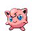

<table><tr><th colspan="1">Encounter Method</th><th colspan="5" style = "text-align: center;">Available Pokémon</th></tr>
<tr><td rowspan="2" style="vertical-align: middle; word-wrap: break-word; text-align: center;">Grass</td><td style="text-align: center; vertical-align: bottom;">    <a href="../../pokemons/055">Golduck</a>   Lv: 41-44   20.0% </td><td style="text-align: center; vertical-align: bottom;">    <a href="../../pokemons/333">Swablu</a>   Lv: 41-44   20.0% </td><td style="text-align: center; vertical-align: bottom;">    <a href="../../pokemons/359">Absol</a>   Lv: 41-44   15.0% </td><td style="text-align: center; vertical-align: bottom;">    <a href="../../pokemons/426">Drifblim</a>   Lv: 41-44   10.0% </td><td style="text-align: center; vertical-align: bottom;">    <a href="../../pokemons/619">Mienfoo</a>   Lv: 41-44   10.0% </td></tr>
<tr><td style="text-align: center; vertical-align: bottom;">    <a href="../../pokemons/357">Tropius</a>   Lv: 41-44   10.0% </td><td style="text-align: center; vertical-align: bottom;">    <a href="../../pokemons/039">Jigglypuff</a>   Lv: 41-44   5.0% </td><td style="text-align: center; vertical-align: bottom;">    <a href="../../pokemons/334">Altaria</a>   Lv: 41-44   5.0% </td><td style="text-align: center; vertical-align: bottom;">    <a href="../../pokemons/113">Chansey</a>   Lv: 41-44   5.0% </td><td></td></tr>
<tr><td rowspan="2" style="vertical-align: middle; word-wrap: break-word; text-align: center;">Dark Grass (Doubles)</td><td style="text-align: center; vertical-align: bottom;">    <a href="../../pokemons/055">Golduck</a>   Lv: 42-46   20.0% </td><td style="text-align: center; vertical-align: bottom;">    <a href="../../pokemons/334">Altaria</a>   Lv: 42-46   25.0% </td><td style="text-align: center; vertical-align: bottom;">    <a href="../../pokemons/359">Absol</a>   Lv: 42-46   15.0% </td><td style="text-align: center; vertical-align: bottom;">    <a href="../../pokemons/426">Drifblim</a>   Lv: 42-46   15.0% </td><td style="text-align: center; vertical-align: bottom;">    <a href="../../pokemons/619">Mienfoo</a>   Lv: 42-46   10.0% </td></tr>
<tr><td style="text-align: center; vertical-align: bottom;">    <a href="../../pokemons/357">Tropius</a>   Lv: 42-46   10.0% </td><td style="text-align: center; vertical-align: bottom;">    <a href="../../pokemons/039">Jigglypuff</a>   Lv: 42-46   5.0% </td><td></td><td></td><td></td></tr>
<tr><td rowspan="1" style="vertical-align: middle; word-wrap: break-word; text-align: center;">Shaking Grass</td><td style="text-align: center; vertical-align: bottom;">    <a href="../../pokemons/531">Audino</a>   Lv: 42-46   80.0% </td><td style="text-align: center; vertical-align: bottom;">    <a href="../../pokemons/587">Emolga</a>   Lv: 42-46   10.0% </td><td style="text-align: center; vertical-align: bottom;">    <a href="../../pokemons/040">Wigglytuff</a>   Lv: 42-46   5.0% </td><td style="text-align: center; vertical-align: bottom;">    <a href="../../pokemons/334">Altaria</a>   Lv: 42-46   5.0% </td><td></td></tr>
<tr><td rowspan="1" style="vertical-align: middle; word-wrap: break-word; text-align: center;">Surf</td><td style="text-align: center; vertical-align: bottom;">    <a href="../../pokemons/550">Basculin-Blue</a>   Lv: 40-46   70.0% </td><td style="text-align: center; vertical-align: bottom;">    <a href="../../pokemons/418">Buizel</a>   Lv: 40-46   30.0% </td><td style="text-align: center; vertical-align: bottom;">    <a href="../../pokemons/419">Floatzel</a>   Lv: 40-46   10.0% </td><td></td><td></td></tr>
<tr><td rowspan="1" style="vertical-align: middle; word-wrap: break-word; text-align: center;">Surf, Rippling Water</td><td style="text-align: center; vertical-align: bottom;">    <a href="../../pokemons/418">Buizel</a>   Lv: 40-46   60.0% </td><td style="text-align: center; vertical-align: bottom;">    <a href="../../pokemons/550">Basculin-Red</a>   Lv: 40-46   30.0% </td><td></td><td></td><td></td></tr>
<tr><td rowspan="1" style="vertical-align: middle; word-wrap: break-word; text-align: center;">Fish</td><td style="text-align: center; vertical-align: bottom;">    <a href="../../pokemons/054">Psyduck</a>   Lv: 40-46   90.0% </td><td style="text-align: center; vertical-align: bottom;">    <a href="../../pokemons/055">Golduck</a>   Lv: 40-46   10.0% </td><td></td><td></td><td></td></tr>
<tr><td rowspan="1" style="vertical-align: middle; word-wrap: break-word; text-align: center;">Fish, Rippling Water</td><td style="text-align: center; vertical-align: bottom;">    <a href="../../pokemons/054">Psyduck</a>   Lv: 40-46   60.0% </td><td style="text-align: center; vertical-align: bottom;">    <a href="../../pokemons/055">Golduck</a>   Lv: 40-46   40.0% </td><td></td><td></td><td></td></tr></table>