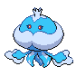

<table><tr><th colspan="1">Encounter Method</th><th colspan="5" style = "text-align: center;">Available Pokémon</th></tr>
<tr><td rowspan="1" style="vertical-align: middle; word-wrap: break-word; text-align: center;">Surf</td><td style="text-align: center; vertical-align: bottom;">    <a href="../../pokemons/592">Frillish</a>   Lv: 45-55   60.0% </td><td style="text-align: center; vertical-align: bottom;">    <a href="../../pokemons/458">Mantyke</a>   Lv: 45-55   30.0% </td><td style="text-align: center; vertical-align: bottom;">    <a href="../../pokemons/489">Phione</a>   Lv: 55-65   10.0% </td><td></td><td></td></tr>
<tr><td rowspan="1" style="vertical-align: middle; word-wrap: break-word; text-align: center;">Surf, Rippling Water</td><td style="text-align: center; vertical-align: bottom;">    <a href="../../pokemons/489">Phione</a>   Lv: 60-70   65.0% </td><td style="text-align: center; vertical-align: bottom;">    <a href="../../pokemons/226">Mantine</a>   Lv: 60-70   30.0% </td><td style="text-align: center; vertical-align: bottom;">    <a href="../../pokemons/593">Jellicent</a>   Lv: 65-75   5.0% </td><td></td><td></td></tr>
<tr><td rowspan="1" style="vertical-align: middle; word-wrap: break-word; text-align: center;">Fish</td><td style="text-align: center; vertical-align: bottom;">    <a href="../../pokemons/456">Finneon</a>   Lv: 50-60   70.0% </td><td style="text-align: center; vertical-align: bottom;">    <a href="../../pokemons/117">Seadra</a>   Lv: 55-65   30.0% </td><td style="text-align: center; vertical-align: bottom;">    <a href="../../pokemons/457">Lumineon</a>   Lv: 65-75   5.0% </td><td style="text-align: center; vertical-align: bottom;">    <a href="../../pokemons/230">Kingdra</a>   Lv: 65-75   5.0% </td><td></td></tr>
<tr><td rowspan="1" style="vertical-align: middle; word-wrap: break-word; text-align: center;">Fish, Rippling Water</td><td style="text-align: center; vertical-align: bottom;">    <a href="../../pokemons/117">Seadra</a>   Lv: 65   60.0% </td><td style="text-align: center; vertical-align: bottom;">    <a href="../../pokemons/211">Qwilfish</a>   Lv: 65   30.0% </td><td></td><td></td><td></td></tr></table>