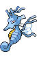

<table><tr><th colspan="1">Encounter Method</th><th colspan="5" style = "text-align: center;">Available Pokémon</th></tr>
<tr><td rowspan="2" style="vertical-align: middle; word-wrap: break-word; text-align: center;">Grass</td><td style="text-align: center; vertical-align: bottom;">    <a href="../../pokemons/560">Scrafty</a>   Lv: 66   20.0% </td><td style="text-align: center; vertical-align: bottom;">    <a href="../../pokemons/558">Crustle</a>   Lv: 65   20.0% </td><td style="text-align: center; vertical-align: bottom;">    <a href="../../pokemons/538">Throh</a>   Lv: 66   10.0% </td><td style="text-align: center; vertical-align: bottom;">    <a href="../../pokemons/539">Sawk</a>   Lv: 66   10.0% </td><td style="text-align: center; vertical-align: bottom;">    <a href="../../pokemons/505">Watchog</a>   Lv: 65   10.0% </td></tr>
<tr><td style="text-align: center; vertical-align: bottom;">    <a href="../../pokemons/115">Kangaskhan</a>   Lv: 66   10.0% </td><td style="text-align: center; vertical-align: bottom;">    <a href="../../pokemons/455">Carnivine</a>   Lv: 66   10.0% </td><td style="text-align: center; vertical-align: bottom;">    <a href="../../pokemons/357">Tropius</a>   Lv: 67   10.0% </td><td></td><td></td></tr>
<tr><td rowspan="2" style="vertical-align: middle; word-wrap: break-word; text-align: center;">Dark Grass (Doubles)</td><td style="text-align: center; vertical-align: bottom;">    <a href="../../pokemons/560">Scrafty</a>   Lv: 72   20.0% </td><td style="text-align: center; vertical-align: bottom;">    <a href="../../pokemons/558">Crustle</a>   Lv: 72   20.0% </td><td style="text-align: center; vertical-align: bottom;">    <a href="../../pokemons/538">Throh</a>   Lv: 71   10.0% </td><td style="text-align: center; vertical-align: bottom;">    <a href="../../pokemons/539">Sawk</a>   Lv: 71   10.0% </td><td style="text-align: center; vertical-align: bottom;">    <a href="../../pokemons/505">Watchog</a>   Lv: 72   10.0% </td></tr>
<tr><td style="text-align: center; vertical-align: bottom;">    <a href="../../pokemons/115">Kangaskhan</a>   Lv: 73   10.0% </td><td style="text-align: center; vertical-align: bottom;">    <a href="../../pokemons/455">Carnivine</a>   Lv: 72   10.0% </td><td style="text-align: center; vertical-align: bottom;">    <a href="../../pokemons/357">Tropius</a>   Lv: 73   10.0% </td><td></td><td></td></tr>
<tr><td rowspan="1" style="vertical-align: middle; word-wrap: break-word; text-align: center;">Shaking Grass</td><td style="text-align: center; vertical-align: bottom;">    <a href="../../pokemons/531">Audino</a>   Lv: 65   50.0% </td><td style="text-align: center; vertical-align: bottom;">    <a href="../../pokemons/531">Audino</a>   Lv: 66   30.0% </td><td style="text-align: center; vertical-align: bottom;">    <a href="../../pokemons/531">Audino</a>   Lv: 67   10.0% </td><td style="text-align: center; vertical-align: bottom;">    <a href="../../pokemons/206">Dunsparce</a>   Lv: 66   10.0% </td><td></td></tr>
<tr><td rowspan="1" style="vertical-align: middle; word-wrap: break-word; text-align: center;">Surf</td><td style="text-align: center; vertical-align: bottom;">    <a href="../../pokemons/592">Frillish</a>   Lv: 55   60.0% </td><td style="text-align: center; vertical-align: bottom;">    <a href="../../pokemons/072">Tentacool</a>   Lv: 55   30.0% </td><td style="text-align: center; vertical-align: bottom;">    <a href="../../pokemons/073">Tentacruel</a>   Lv: 65   10.0% </td><td></td><td></td></tr>
<tr><td rowspan="1" style="vertical-align: middle; word-wrap: break-word; text-align: center;">Surf, Rippling Water</td><td style="text-align: center; vertical-align: bottom;">    <a href="../../pokemons/594">Alomomola</a>   Lv: 65   60.0% </td><td style="text-align: center; vertical-align: bottom;">    <a href="../../pokemons/073">Tentacruel</a>   Lv: 65   30.0% </td><td style="text-align: center; vertical-align: bottom;">    <a href="../../pokemons/593">Jellicent</a>   Lv: 65   10.0% </td><td></td><td></td></tr>
<tr><td rowspan="1" style="vertical-align: middle; word-wrap: break-word; text-align: center;">Fish</td><td style="text-align: center; vertical-align: bottom;">    <a href="../../pokemons/456">Finneon</a>   Lv: 55   65.0% </td><td style="text-align: center; vertical-align: bottom;">    <a href="../../pokemons/170">Chinchou</a>   Lv: 55   30.0% </td><td style="text-align: center; vertical-align: bottom;">    <a href="../../pokemons/117">Seadra</a>   Lv: 60   5.0% </td><td style="text-align: center; vertical-align: bottom;">    <a href="../../pokemons/171">Lanturn</a>   Lv: 55-75   5.0% </td><td></td></tr>
<tr><td rowspan="1" style="vertical-align: middle; word-wrap: break-word; text-align: center;">Fish, Rippling Water</td><td style="text-align: center; vertical-align: bottom;">    <a href="../../pokemons/457">Lumineon</a>   Lv: 55-75   60.0% </td><td style="text-align: center; vertical-align: bottom;">    <a href="../../pokemons/211">Qwilfish</a>   Lv: 55-75   30.0% </td><td style="text-align: center; vertical-align: bottom;">    <a href="../../pokemons/230">Kingdra</a>   Lv: 55-75   10.0% </td><td></td><td></td></tr>
<tr><td rowspan="2" style="vertical-align: middle; word-wrap: break-word; text-align: center;">Hidden Grotto</td><td style="text-align: center; vertical-align: bottom;">    <a href="../../pokemons/099">Kingler</a>   Lv: ??   3.75% </td><td style="text-align: center; vertical-align: bottom;">    <a href="../../pokemons/342">Crawdaunt</a>   Lv: ??   3.75% </td><td style="text-align: center; vertical-align: bottom;">    <a href="../../pokemons/441">Chatot</a>   Lv: ??   3.75% </td><td style="text-align: center; vertical-align: bottom;">    <a href="../../pokemons/149">Dragonite</a>   Lv: ??   3.75% </td><td style="text-align: center; vertical-align: bottom;">    <a href="../../pokemons/349">Feebas</a>   Lv: ??   2.0% </td></tr>
<tr><td style="text-align: center; vertical-align: bottom;">    <a href="../../pokemons/558">Crustle</a>   Lv: ??   2.0% </td><td style="text-align: center; vertical-align: bottom;">    <a href="../../pokemons/596">Galvantula</a>   Lv: ??   0.5% </td><td style="text-align: center; vertical-align: bottom;">    <a href="../../pokemons/556">Maractus</a>   Lv: ??   0.5% </td><td></td><td></td></tr></table>