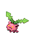
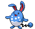

<table><tr><th colspan="1">Encounter Method</th><th colspan="5" style = "text-align: center;">Available Pokémon</th></tr>
<tr><td rowspan="2" style="vertical-align: middle; word-wrap: break-word; text-align: center;">Grass</td><td style="text-align: center; vertical-align: bottom;">    <a href="../../pokemons/504">Patrat</a>   Lv: 03-05   20.0% </td><td style="text-align: center; vertical-align: bottom;">    <a href="../../pokemons/509">Purrloin</a>   Lv: 03-05   20.0% </td><td style="text-align: center; vertical-align: bottom;">    <a href="../../pokemons/396">Starly</a>   Lv: 03-05   10.0% </td><td style="text-align: center; vertical-align: bottom;">    <a href="../../pokemons/016">Pidgey</a>   Lv: 03-05   10.0% </td><td style="text-align: center; vertical-align: bottom;">    <a href="../../pokemons/401">Kricketot</a>   Lv: 03-05   10.0% </td></tr>
<tr><td style="text-align: center; vertical-align: bottom;">    <a href="../../pokemons/161">Sentret</a>   Lv: 03-05   10.0% </td><td style="text-align: center; vertical-align: bottom;">    <a href="../../pokemons/048">Venonat</a>   Lv: 03-05   5.0% </td><td style="text-align: center; vertical-align: bottom;">    <a href="../../pokemons/399">Bidoof</a>   Lv: 03-05   5.0% </td><td style="text-align: center; vertical-align: bottom;">    <a href="../../pokemons/165">Ledyba</a>   Lv: 03-05   5.0% </td><td style="text-align: center; vertical-align: bottom;">    <a href="../../pokemons/187">Hoppip</a>   Lv: 03-05   5.0% </td></tr>
<tr><td rowspan="1" style="vertical-align: middle; word-wrap: break-word; text-align: center;">Shaking Grass</td><td style="text-align: center; vertical-align: bottom;">    <a href="../../pokemons/531">Audino</a>   Lv: 02   60.0% </td><td style="text-align: center; vertical-align: bottom;">    <a href="../../pokemons/531">Audino</a>   Lv: 03   30.0% </td><td style="text-align: center; vertical-align: bottom;">    <a href="../../pokemons/531">Audino</a>   Lv: 04   10.0% </td><td></td><td></td></tr>
<tr><td rowspan="1" style="vertical-align: middle; word-wrap: break-word; text-align: center;">Surf</td><td style="text-align: center; vertical-align: bottom;">    <a href="../../pokemons/183">Marill</a>   Lv: 30-40   70.0% </td><td style="text-align: center; vertical-align: bottom;">    <a href="../../pokemons/283">Surskit</a>   Lv: 30-40   30.0% </td><td></td><td></td><td></td></tr>
<tr><td rowspan="1" style="vertical-align: middle; word-wrap: break-word; text-align: center;">Surf, Rippling Water</td><td style="text-align: center; vertical-align: bottom;">    <a href="../../pokemons/283">Surskit</a>   Lv: 35-45   70.0% </td><td style="text-align: center; vertical-align: bottom;">    <a href="../../pokemons/184">Azumarill</a>   Lv: 35-45   30.0% </td><td></td><td></td><td></td></tr>
<tr><td rowspan="1" style="vertical-align: middle; word-wrap: break-word; text-align: center;">Fish</td><td style="text-align: center; vertical-align: bottom;">    <a href="../../pokemons/550">Basculin-Red</a>   Lv: 05   90.0% </td><td style="text-align: center; vertical-align: bottom;">    <a href="../../pokemons/283">Surskit</a>   Lv: 05   5.0% </td><td style="text-align: center; vertical-align: bottom;">    <a href="../../pokemons/120">Staryu</a>   Lv: 05   5.0% </td><td></td><td></td></tr>
<tr><td rowspan="1" style="vertical-align: middle; word-wrap: break-word; text-align: center;">Fish, Rippling Water</td><td style="text-align: center; vertical-align: bottom;">    <a href="../../pokemons/550">Basculin-Red</a>   Lv: 05-15   70.0% </td><td style="text-align: center; vertical-align: bottom;">    <a href="../../pokemons/283">Surskit</a>   Lv: 05-15   30.0% </td><td></td><td></td><td></td></tr></table>