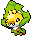
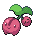

## Spring

<table><tr><th colspan="1">Encounter Method</th><th colspan="5" style = "text-align: center;">Available Pokémon</th></tr>
<tr><td rowspan="3" style="vertical-align: middle; word-wrap: break-word; text-align: center;">Grass</td><td style="text-align: center; vertical-align: bottom;">    <a href="../../pokemons/519">Pidove</a>   Lv: 05-07   20.0% </td><td style="text-align: center; vertical-align: bottom;">    <a href="../../pokemons/540">Sewaddle</a>   Lv: 05-07   20.0% </td><td style="text-align: center; vertical-align: bottom;">    <a href="../../pokemons/104">Cubone</a>   Lv: 05-07   10.0% </td><td style="text-align: center; vertical-align: bottom;">    <a href="../../pokemons/270">Lotad</a>   Lv: 05-07   10.0% </td><td style="text-align: center; vertical-align: bottom;">    <a href="../../pokemons/273">Seedot</a>   Lv: 05-07   10.0% </td></tr>
<tr><td style="text-align: center; vertical-align: bottom;">    <a href="../../pokemons/069">Bellsprout</a>   Lv: 05-07   10.0% </td><td style="text-align: center; vertical-align: bottom;">    <a href="../../pokemons/280">Ralts</a>   Lv: 05-07   5.0% </td><td style="text-align: center; vertical-align: bottom;">    <a href="../../pokemons/285">Shroomish</a>   Lv: 05-07   5.0% </td><td style="text-align: center; vertical-align: bottom;">    <a href="../../pokemons/056">Mankey</a>   Lv: 05-07   4.0% </td><td style="text-align: center; vertical-align: bottom;">    <a href="../../pokemons/371">Bagon</a>   Lv: 05-07   4.0% </td></tr>
<tr><td style="text-align: center; vertical-align: bottom;">    <a href="../../pokemons/052">Meowth</a>   Lv: 05-07   2.0% </td><td></td><td></td><td></td><td></td></tr>
<tr><td rowspan="3" style="vertical-align: middle; word-wrap: break-word; text-align: center;">Dark Grass (Doubles)</td><td style="text-align: center; vertical-align: bottom;">    <a href="../../pokemons/191">Sunkern</a>   Lv: 11-14   20.0% </td><td style="text-align: center; vertical-align: bottom;">    <a href="../../pokemons/543">Venipede</a>   Lv: 11-14   20.0% </td><td style="text-align: center; vertical-align: bottom;">    <a href="../../pokemons/265">Wurmple</a>   Lv: 11-14   10.0% </td><td style="text-align: center; vertical-align: bottom;">    <a href="../../pokemons/010">Caterpie</a>   Lv: 11-14   10.0% </td><td style="text-align: center; vertical-align: bottom;">    <a href="../../pokemons/013">Weedle</a>   Lv: 11-14   10.0% </td></tr>
<tr><td style="text-align: center; vertical-align: bottom;">    <a href="../../pokemons/540">Sewaddle</a>   Lv: 11-14   10.0% </td><td style="text-align: center; vertical-align: bottom;">    <a href="../../pokemons/438">Bonsly</a>   Lv: 11-14   5.0% </td><td style="text-align: center; vertical-align: bottom;">    <a href="../../pokemons/439">Mime Jr.</a>   Lv: 11-14   5.0% </td><td style="text-align: center; vertical-align: bottom;">    <a href="../../pokemons/285">Shroomish</a>   Lv: 11-14   4.0% </td><td style="text-align: center; vertical-align: bottom;">    <a href="../../pokemons/406">Budew</a>   Lv: 11-14   4.0% </td></tr>
<tr><td style="text-align: center; vertical-align: bottom;">    <a href="../../pokemons/371">Bagon</a>   Lv: 11-14   2.0% </td><td></td><td></td><td></td><td></td></tr>
<tr><td rowspan="1" style="vertical-align: middle; word-wrap: break-word; text-align: center;">Shaking Grass</td><td style="text-align: center; vertical-align: bottom;">    <a href="../../pokemons/531">Audino</a>   Lv: 04   50.0% </td><td style="text-align: center; vertical-align: bottom;">    <a href="../../pokemons/531">Audino</a>   Lv: 05   30.0% </td><td style="text-align: center; vertical-align: bottom;">    <a href="../../pokemons/531">Audino</a>   Lv: 06   10.0% </td><td style="text-align: center; vertical-align: bottom;">    <a href="../../pokemons/206">Dunsparce</a>   Lv: 04   10.0% </td><td></td></tr>
<tr><td rowspan="1" style="vertical-align: middle; word-wrap: break-word; text-align: center;">Surf</td><td style="text-align: center; vertical-align: bottom;">    <a href="../../pokemons/298">Azurill</a>   Lv: 05-35   65.0% </td><td style="text-align: center; vertical-align: bottom;">    <a href="../../pokemons/283">Surskit</a>   Lv: 05-35   30.0% </td><td style="text-align: center; vertical-align: bottom;">    <a href="../../pokemons/147">Dratini</a>   Lv: 05-35   5.0% </td><td style="text-align: center; vertical-align: bottom;">    <a href="../../pokemons/148">Dragonair</a>   Lv: 35-45   5.0% </td><td></td></tr>
<tr><td rowspan="1" style="vertical-align: middle; word-wrap: break-word; text-align: center;">Surf, Rippling Water</td><td style="text-align: center; vertical-align: bottom;">    <a href="../../pokemons/283">Surskit</a>   Lv: 30-40   60.0% </td><td style="text-align: center; vertical-align: bottom;">    <a href="../../pokemons/183">Marill</a>   Lv: 30-40   30.0% </td><td style="text-align: center; vertical-align: bottom;">    <a href="../../pokemons/147">Dratini</a>   Lv: 30-40   5.0% </td><td></td><td></td></tr>
<tr><td rowspan="1" style="vertical-align: middle; word-wrap: break-word; text-align: center;">Fish</td><td style="text-align: center; vertical-align: bottom;">    <a href="../../pokemons/550">Basculin-Blue</a>   Lv: 05-15   60.0% </td><td style="text-align: center; vertical-align: bottom;">    <a href="../../pokemons/147">Dratini</a>   Lv: 05-15   40.0% </td><td></td><td></td><td></td></tr>
<tr><td rowspan="1" style="vertical-align: middle; word-wrap: break-word; text-align: center;">Fish, Rippling Water</td><td style="text-align: center; vertical-align: bottom;">    <a href="../../pokemons/550">Basculin-Blue</a>   Lv: 05-15   60.0% </td><td style="text-align: center; vertical-align: bottom;">    <a href="../../pokemons/147">Dratini</a>   Lv: 05-15   40.0% </td><td></td><td></td><td></td></tr></table>
## Summer

<table><tr><th colspan="1">Encounter Method</th><th colspan="5" style = "text-align: center;">Available Pokémon</th></tr>
<tr><td rowspan="3" style="vertical-align: middle; word-wrap: break-word; text-align: center;">Grass</td><td style="text-align: center; vertical-align: bottom;">    <a href="../../pokemons/519">Pidove</a>   Lv: 05-07   20.0% </td><td style="text-align: center; vertical-align: bottom;">    <a href="../../pokemons/540">Sewaddle</a>   Lv: 05-07   20.0% </td><td style="text-align: center; vertical-align: bottom;">    <a href="../../pokemons/104">Cubone</a>   Lv: 05-07   10.0% </td><td style="text-align: center; vertical-align: bottom;">    <a href="../../pokemons/270">Lotad</a>   Lv: 05-07   10.0% </td><td style="text-align: center; vertical-align: bottom;">    <a href="../../pokemons/273">Seedot</a>   Lv: 05-07   10.0% </td></tr>
<tr><td style="text-align: center; vertical-align: bottom;">    <a href="../../pokemons/069">Bellsprout</a>   Lv: 05-07   10.0% </td><td style="text-align: center; vertical-align: bottom;">    <a href="../../pokemons/280">Ralts</a>   Lv: 05-07   5.0% </td><td style="text-align: center; vertical-align: bottom;">    <a href="../../pokemons/420">Cherubi</a>   Lv: 05-07   5.0% </td><td style="text-align: center; vertical-align: bottom;">    <a href="../../pokemons/056">Mankey</a>   Lv: 05-07   4.0% </td><td style="text-align: center; vertical-align: bottom;">    <a href="../../pokemons/371">Bagon</a>   Lv: 05-07   4.0% </td></tr>
<tr><td style="text-align: center; vertical-align: bottom;">    <a href="../../pokemons/052">Meowth</a>   Lv: 05-07   2.0% </td><td></td><td></td><td></td><td></td></tr>
<tr><td rowspan="3" style="vertical-align: middle; word-wrap: break-word; text-align: center;">Dark Grass (Doubles)</td><td style="text-align: center; vertical-align: bottom;">    <a href="../../pokemons/191">Sunkern</a>   Lv: 11-14   20.0% </td><td style="text-align: center; vertical-align: bottom;">    <a href="../../pokemons/543">Venipede</a>   Lv: 11-14   20.0% </td><td style="text-align: center; vertical-align: bottom;">    <a href="../../pokemons/265">Wurmple</a>   Lv: 11-14   10.0% </td><td style="text-align: center; vertical-align: bottom;">    <a href="../../pokemons/010">Caterpie</a>   Lv: 11-14   10.0% </td><td style="text-align: center; vertical-align: bottom;">    <a href="../../pokemons/013">Weedle</a>   Lv: 11-14   10.0% </td></tr>
<tr><td style="text-align: center; vertical-align: bottom;">    <a href="../../pokemons/540">Sewaddle</a>   Lv: 11-14   10.0% </td><td style="text-align: center; vertical-align: bottom;">    <a href="../../pokemons/438">Bonsly</a>   Lv: 11-14   5.0% </td><td style="text-align: center; vertical-align: bottom;">    <a href="../../pokemons/439">Mime Jr.</a>   Lv: 11-14   5.0% </td><td style="text-align: center; vertical-align: bottom;">    <a href="../../pokemons/420">Cherubi</a>   Lv: 11-14   4.0% </td><td style="text-align: center; vertical-align: bottom;">    <a href="../../pokemons/406">Budew</a>   Lv: 11-14   4.0% </td></tr>
<tr><td style="text-align: center; vertical-align: bottom;">    <a href="../../pokemons/371">Bagon</a>   Lv: 11-14   2.0% </td><td></td><td></td><td></td><td></td></tr>
<tr><td rowspan="1" style="vertical-align: middle; word-wrap: break-word; text-align: center;">Shaking Grass</td><td style="text-align: center; vertical-align: bottom;">    <a href="../../pokemons/531">Audino</a>   Lv: 05   80.0% </td><td style="text-align: center; vertical-align: bottom;">    <a href="../../pokemons/531">Audino</a>   Lv: 06   10.0% </td><td style="text-align: center; vertical-align: bottom;">    <a href="../../pokemons/206">Dunsparce</a>   Lv: 05   10.0% </td><td></td><td></td></tr>
<tr><td rowspan="1" style="vertical-align: middle; word-wrap: break-word; text-align: center;">Surf</td><td style="text-align: center; vertical-align: bottom;">    <a href="../../pokemons/298">Azurill</a>   Lv: 05-35   65.0% </td><td style="text-align: center; vertical-align: bottom;">    <a href="../../pokemons/283">Surskit</a>   Lv: 05-35   30.0% </td><td style="text-align: center; vertical-align: bottom;">    <a href="../../pokemons/147">Dratini</a>   Lv: 05-35   5.0% </td><td style="text-align: center; vertical-align: bottom;">    <a href="../../pokemons/148">Dragonair</a>   Lv: 35-45   5.0% </td><td></td></tr>
<tr><td rowspan="1" style="vertical-align: middle; word-wrap: break-word; text-align: center;">Surf, Rippling Water</td><td style="text-align: center; vertical-align: bottom;">    <a href="../../pokemons/283">Surskit</a>   Lv: 30-40   60.0% </td><td style="text-align: center; vertical-align: bottom;">    <a href="../../pokemons/183">Marill</a>   Lv: 30-40   30.0% </td><td style="text-align: center; vertical-align: bottom;">    <a href="../../pokemons/147">Dratini</a>   Lv: 30-40   5.0% </td><td></td><td></td></tr>
<tr><td rowspan="1" style="vertical-align: middle; word-wrap: break-word; text-align: center;">Fish</td><td style="text-align: center; vertical-align: bottom;">    <a href="../../pokemons/550">Basculin-Blue</a>   Lv: 05-15   60.0% </td><td style="text-align: center; vertical-align: bottom;">    <a href="../../pokemons/147">Dratini</a>   Lv: 05-15   40.0% </td><td></td><td></td><td></td></tr>
<tr><td rowspan="1" style="vertical-align: middle; word-wrap: break-word; text-align: center;">Fish, Rippling Water</td><td style="text-align: center; vertical-align: bottom;">    <a href="../../pokemons/550">Basculin-Blue</a>   Lv: 05-15   60.0% </td><td style="text-align: center; vertical-align: bottom;">    <a href="../../pokemons/147">Dratini</a>   Lv: 05-15   40.0% </td><td></td><td></td><td></td></tr></table>
## Autumn

<table><tr><th colspan="1">Encounter Method</th><th colspan="5" style = "text-align: center;">Available Pokémon</th></tr>
<tr><td rowspan="3" style="vertical-align: middle; word-wrap: break-word; text-align: center;">Grass</td><td style="text-align: center; vertical-align: bottom;">    <a href="../../pokemons/519">Pidove</a>   Lv: 05-07   20.0% </td><td style="text-align: center; vertical-align: bottom;">    <a href="../../pokemons/540">Sewaddle</a>   Lv: 05-07   20.0% </td><td style="text-align: center; vertical-align: bottom;">    <a href="../../pokemons/104">Cubone</a>   Lv: 05-07   10.0% </td><td style="text-align: center; vertical-align: bottom;">    <a href="../../pokemons/270">Lotad</a>   Lv: 05-07   10.0% </td><td style="text-align: center; vertical-align: bottom;">    <a href="../../pokemons/273">Seedot</a>   Lv: 05-07   10.0% </td></tr>
<tr><td style="text-align: center; vertical-align: bottom;">    <a href="../../pokemons/069">Bellsprout</a>   Lv: 05-07   10.0% </td><td style="text-align: center; vertical-align: bottom;">    <a href="../../pokemons/280">Ralts</a>   Lv: 05-07   5.0% </td><td style="text-align: center; vertical-align: bottom;">    <a href="../../pokemons/285">Shroomish</a>   Lv: 05-07   5.0% </td><td style="text-align: center; vertical-align: bottom;">    <a href="../../pokemons/056">Mankey</a>   Lv: 05-07   4.0% </td><td style="text-align: center; vertical-align: bottom;">    <a href="../../pokemons/371">Bagon</a>   Lv: 05-07   4.0% </td></tr>
<tr><td style="text-align: center; vertical-align: bottom;">    <a href="../../pokemons/052">Meowth</a>   Lv: 05-07   2.0% </td><td></td><td></td><td></td><td></td></tr>
<tr><td rowspan="3" style="vertical-align: middle; word-wrap: break-word; text-align: center;">Dark Grass (Doubles)</td><td style="text-align: center; vertical-align: bottom;">    <a href="../../pokemons/191">Sunkern</a>   Lv: 11-14   20.0% </td><td style="text-align: center; vertical-align: bottom;">    <a href="../../pokemons/543">Venipede</a>   Lv: 11-14   20.0% </td><td style="text-align: center; vertical-align: bottom;">    <a href="../../pokemons/265">Wurmple</a>   Lv: 11-14   10.0% </td><td style="text-align: center; vertical-align: bottom;">    <a href="../../pokemons/010">Caterpie</a>   Lv: 11-14   10.0% </td><td style="text-align: center; vertical-align: bottom;">    <a href="../../pokemons/013">Weedle</a>   Lv: 11-14   10.0% </td></tr>
<tr><td style="text-align: center; vertical-align: bottom;">    <a href="../../pokemons/540">Sewaddle</a>   Lv: 11-14   10.0% </td><td style="text-align: center; vertical-align: bottom;">    <a href="../../pokemons/438">Bonsly</a>   Lv: 11-14   5.0% </td><td style="text-align: center; vertical-align: bottom;">    <a href="../../pokemons/439">Mime Jr.</a>   Lv: 11-14   5.0% </td><td style="text-align: center; vertical-align: bottom;">    <a href="../../pokemons/285">Shroomish</a>   Lv: 11-14   4.0% </td><td style="text-align: center; vertical-align: bottom;">    <a href="../../pokemons/406">Budew</a>   Lv: 11-14   4.0% </td></tr>
<tr><td style="text-align: center; vertical-align: bottom;">    <a href="../../pokemons/371">Bagon</a>   Lv: 11-14   2.0% </td><td></td><td></td><td></td><td></td></tr>
<tr><td rowspan="1" style="vertical-align: middle; word-wrap: break-word; text-align: center;">Shaking Grass</td><td style="text-align: center; vertical-align: bottom;">    <a href="../../pokemons/531">Audino</a>   Lv: 05   80.0% </td><td style="text-align: center; vertical-align: bottom;">    <a href="../../pokemons/531">Audino</a>   Lv: 06   10.0% </td><td style="text-align: center; vertical-align: bottom;">    <a href="../../pokemons/206">Dunsparce</a>   Lv: 05   10.0% </td><td></td><td></td></tr>
<tr><td rowspan="1" style="vertical-align: middle; word-wrap: break-word; text-align: center;">Surf</td><td style="text-align: center; vertical-align: bottom;">    <a href="../../pokemons/298">Azurill</a>   Lv: 05-35   65.0% </td><td style="text-align: center; vertical-align: bottom;">    <a href="../../pokemons/283">Surskit</a>   Lv: 05-35   30.0% </td><td style="text-align: center; vertical-align: bottom;">    <a href="../../pokemons/147">Dratini</a>   Lv: 05-35   5.0% </td><td style="text-align: center; vertical-align: bottom;">    <a href="../../pokemons/148">Dragonair</a>   Lv: 35-45   5.0% </td><td></td></tr>
<tr><td rowspan="1" style="vertical-align: middle; word-wrap: break-word; text-align: center;">Surf, Rippling Water</td><td style="text-align: center; vertical-align: bottom;">    <a href="../../pokemons/283">Surskit</a>   Lv: 30-40   60.0% </td><td style="text-align: center; vertical-align: bottom;">    <a href="../../pokemons/183">Marill</a>   Lv: 30-40   30.0% </td><td style="text-align: center; vertical-align: bottom;">    <a href="../../pokemons/147">Dratini</a>   Lv: 30-40   5.0% </td><td></td><td></td></tr>
<tr><td rowspan="1" style="vertical-align: middle; word-wrap: break-word; text-align: center;">Fish</td><td style="text-align: center; vertical-align: bottom;">    <a href="../../pokemons/550">Basculin-Blue</a>   Lv: 05-15   60.0% </td><td style="text-align: center; vertical-align: bottom;">    <a href="../../pokemons/147">Dratini</a>   Lv: 05-15   40.0% </td><td></td><td></td><td></td></tr>
<tr><td rowspan="1" style="vertical-align: middle; word-wrap: break-word; text-align: center;">Fish, Rippling Water</td><td style="text-align: center; vertical-align: bottom;">    <a href="../../pokemons/550">Basculin-Blue</a>   Lv: 05-15   60.0% </td><td style="text-align: center; vertical-align: bottom;">    <a href="../../pokemons/147">Dratini</a>   Lv: 05-15   40.0% </td><td></td><td></td><td></td></tr></table>
## Winter

<table><tr><th colspan="1">Encounter Method</th><th colspan="5" style = "text-align: center;">Available Pokémon</th></tr>
<tr><td rowspan="3" style="vertical-align: middle; word-wrap: break-word; text-align: center;">Grass</td><td style="text-align: center; vertical-align: bottom;">    <a href="../../pokemons/519">Pidove</a>   Lv: 05-07   20.0% </td><td style="text-align: center; vertical-align: bottom;">    <a href="../../pokemons/540">Sewaddle</a>   Lv: 05-07   20.0% </td><td style="text-align: center; vertical-align: bottom;">    <a href="../../pokemons/104">Cubone</a>   Lv: 05-07   10.0% </td><td style="text-align: center; vertical-align: bottom;">    <a href="../../pokemons/270">Lotad</a>   Lv: 05-07   10.0% </td><td style="text-align: center; vertical-align: bottom;">    <a href="../../pokemons/273">Seedot</a>   Lv: 05-07   10.0% </td></tr>
<tr><td style="text-align: center; vertical-align: bottom;">    <a href="../../pokemons/220">Swinub</a>   Lv: 05-07   10.0% </td><td style="text-align: center; vertical-align: bottom;">    <a href="../../pokemons/280">Ralts</a>   Lv: 05-07   5.0% </td><td style="text-align: center; vertical-align: bottom;">    <a href="../../pokemons/582">Vanillite</a>   Lv: 05-07   5.0% </td><td style="text-align: center; vertical-align: bottom;">    <a href="../../pokemons/056">Mankey</a>   Lv: 05-07   4.0% </td><td style="text-align: center; vertical-align: bottom;">    <a href="../../pokemons/371">Bagon</a>   Lv: 05-07   4.0% </td></tr>
<tr><td style="text-align: center; vertical-align: bottom;">    <a href="../../pokemons/052">Meowth</a>   Lv: 05-07   2.0% </td><td></td><td></td><td></td><td></td></tr>
<tr><td rowspan="3" style="vertical-align: middle; word-wrap: break-word; text-align: center;">Dark Grass (Doubles)</td><td style="text-align: center; vertical-align: bottom;">    <a href="../../pokemons/191">Sunkern</a>   Lv: 11-14   20.0% </td><td style="text-align: center; vertical-align: bottom;">    <a href="../../pokemons/543">Venipede</a>   Lv: 11-14   20.0% </td><td style="text-align: center; vertical-align: bottom;">    <a href="../../pokemons/265">Wurmple</a>   Lv: 11-14   10.0% </td><td style="text-align: center; vertical-align: bottom;">    <a href="../../pokemons/010">Caterpie</a>   Lv: 11-14   10.0% </td><td style="text-align: center; vertical-align: bottom;">    <a href="../../pokemons/013">Weedle</a>   Lv: 11-14   10.0% </td></tr>
<tr><td style="text-align: center; vertical-align: bottom;">    <a href="../../pokemons/220">Swinub</a>   Lv: 11-14   10.0% </td><td style="text-align: center; vertical-align: bottom;">    <a href="../../pokemons/438">Bonsly</a>   Lv: 11-14   5.0% </td><td style="text-align: center; vertical-align: bottom;">    <a href="../../pokemons/439">Mime Jr.</a>   Lv: 11-14   5.0% </td><td style="text-align: center; vertical-align: bottom;">    <a href="../../pokemons/582">Vanillite</a>   Lv: 11-14   4.0% </td><td style="text-align: center; vertical-align: bottom;">    <a href="../../pokemons/406">Budew</a>   Lv: 11-14   4.0% </td></tr>
<tr><td style="text-align: center; vertical-align: bottom;">    <a href="../../pokemons/371">Bagon</a>   Lv: 11-14   2.0% </td><td></td><td></td><td></td><td></td></tr>
<tr><td rowspan="1" style="vertical-align: middle; word-wrap: break-word; text-align: center;">Shaking Grass</td><td style="text-align: center; vertical-align: bottom;">    <a href="../../pokemons/531">Audino</a>   Lv: 04   50.0% </td><td style="text-align: center; vertical-align: bottom;">    <a href="../../pokemons/531">Audino</a>   Lv: 05   60.0% </td><td style="text-align: center; vertical-align: bottom;">    <a href="../../pokemons/531">Audino</a>   Lv: 06   10.0% </td><td style="text-align: center; vertical-align: bottom;">    <a href="../../pokemons/206">Dunsparce</a>   Lv: 04   10.0% </td><td></td></tr>
<tr><td rowspan="1" style="vertical-align: middle; word-wrap: break-word; text-align: center;">Surf</td><td style="text-align: center; vertical-align: bottom;">    <a href="../../pokemons/298">Azurill</a>   Lv: 05-35   65.0% </td><td style="text-align: center; vertical-align: bottom;">    <a href="../../pokemons/283">Surskit</a>   Lv: 05-35   30.0% </td><td style="text-align: center; vertical-align: bottom;">    <a href="../../pokemons/086">Seel</a>   Lv: 05-35   5.0% </td><td style="text-align: center; vertical-align: bottom;">    <a href="../../pokemons/087">Dewgong</a>   Lv: 35-45   5.0% </td><td></td></tr>
<tr><td rowspan="1" style="vertical-align: middle; word-wrap: break-word; text-align: center;">Surf, Rippling Water</td><td style="text-align: center; vertical-align: bottom;">    <a href="../../pokemons/283">Surskit</a>   Lv: 30-40   60.0% </td><td style="text-align: center; vertical-align: bottom;">    <a href="../../pokemons/183">Marill</a>   Lv: 30-40   30.0% </td><td style="text-align: center; vertical-align: bottom;">    <a href="../../pokemons/086">Seel</a>   Lv: 30-40   5.0% </td><td></td><td></td></tr>
<tr><td rowspan="1" style="vertical-align: middle; word-wrap: break-word; text-align: center;">Fish</td><td style="text-align: center; vertical-align: bottom;">    <a href="../../pokemons/550">Basculin-Blue</a>   Lv: 05-15   60.0% </td><td style="text-align: center; vertical-align: bottom;">    <a href="../../pokemons/147">Dratini</a>   Lv: 05-15   40.0% </td><td></td><td></td><td></td></tr>
<tr><td rowspan="1" style="vertical-align: middle; word-wrap: break-word; text-align: center;">Fish, Rippling Water</td><td style="text-align: center; vertical-align: bottom;">    <a href="../../pokemons/550">Basculin-Blue</a>   Lv: 05-15   60.0% </td><td style="text-align: center; vertical-align: bottom;">    <a href="../../pokemons/147">Dratini</a>   Lv: 05-15   40.0% </td><td></td><td></td><td></td></tr></table>
