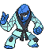
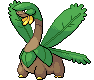

<table><tr><th colspan="1">Encounter Method</th><th colspan="5" style = "text-align: center;">Available Pokémon</th></tr>
<tr><td rowspan="2" style="vertical-align: middle; word-wrap: break-word; text-align: center;">Grass</td><td style="text-align: center; vertical-align: bottom;">    <a href="../../pokemons/626">Bouffalant</a>   Lv: 58-61   20.0% </td><td style="text-align: center; vertical-align: bottom;">    <a href="../../pokemons/619">Mienfoo</a>   Lv: 58-61   20.0% </td><td style="text-align: center; vertical-align: bottom;">    <a href="../../pokemons/539">Sawk</a>   Lv: 58-61   10.0% </td><td style="text-align: center; vertical-align: bottom;">    <a href="../../pokemons/538">Throh</a>   Lv: 58-61   10.0% </td><td style="text-align: center; vertical-align: bottom;">    <a href="../../pokemons/629">Vullaby</a>   Lv: 58-61   10.0% </td></tr>
<tr><td style="text-align: center; vertical-align: bottom;">    <a href="../../pokemons/627">Rufflet</a>   Lv: 58-61   10.0% </td><td style="text-align: center; vertical-align: bottom;">    <a href="../../pokemons/357">Tropius</a>   Lv: 58-61   5.0% </td><td style="text-align: center; vertical-align: bottom;">    <a href="../../pokemons/591">Amoonguss</a>   Lv: 58-61   5.0% </td><td style="text-align: center; vertical-align: bottom;">    <a href="../../pokemons/207">Gligar</a>   Lv: 58-61   5.0% </td><td style="text-align: center; vertical-align: bottom;">    <a href="../../pokemons/128">Tauros</a>   Lv: 58-61   5.0% </td></tr>
<tr><td rowspan="2" style="vertical-align: middle; word-wrap: break-word; text-align: center;">Dark Grass (Doubles)</td><td style="text-align: center; vertical-align: bottom;">    <a href="../../pokemons/626">Bouffalant</a>   Lv: 59-62   20.0% </td><td style="text-align: center; vertical-align: bottom;">    <a href="../../pokemons/620">Mienshao</a>   Lv: 59-62   20.0% </td><td style="text-align: center; vertical-align: bottom;">    <a href="../../pokemons/539">Sawk</a>   Lv: 59-62   10.0% </td><td style="text-align: center; vertical-align: bottom;">    <a href="../../pokemons/538">Throh</a>   Lv: 59-62   10.0% </td><td style="text-align: center; vertical-align: bottom;">    <a href="../../pokemons/630">Mandibuzz</a>   Lv: 59-62   10.0% </td></tr>
<tr><td style="text-align: center; vertical-align: bottom;">    <a href="../../pokemons/628">Braviary</a>   Lv: 59-62   10.0% </td><td style="text-align: center; vertical-align: bottom;">    <a href="../../pokemons/357">Tropius</a>   Lv: 59-62   10.0% </td><td style="text-align: center; vertical-align: bottom;">    <a href="../../pokemons/591">Amoonguss</a>   Lv: 59-62   10.0% </td><td></td><td></td></tr>
<tr><td rowspan="1" style="vertical-align: middle; word-wrap: break-word; text-align: center;">Shaking Grass</td><td style="text-align: center; vertical-align: bottom;">    <a href="../../pokemons/531">Audino</a>   Lv: 59-62   85.0% </td><td style="text-align: center; vertical-align: bottom;">    <a href="../../pokemons/587">Emolga</a>   Lv: 59-62   15.0% </td><td></td><td></td><td></td></tr>
<tr><td rowspan="1" style="vertical-align: middle; word-wrap: break-word; text-align: center;">Surf</td><td style="text-align: center; vertical-align: bottom;">    <a href="../../pokemons/194">Wooper</a>   Lv: 55-65   60.0% </td><td style="text-align: center; vertical-align: bottom;">    <a href="../../pokemons/422">Shellos-East</a>   Lv: 55-65   30.0% </td><td style="text-align: center; vertical-align: bottom;">    <a href="../../pokemons/423">Gastrodon-East</a>   Lv: 55-65   5.0% </td><td style="text-align: center; vertical-align: bottom;">    <a href="../../pokemons/195">Quagsire</a>   Lv: 55-65   5.0% </td><td></td></tr>
<tr><td rowspan="1" style="vertical-align: middle; word-wrap: break-word; text-align: center;">Surf, Rippling Water</td><td style="text-align: center; vertical-align: bottom;">    <a href="../../pokemons/422">Shellos-East</a>   Lv: 55-65   60.0% </td><td style="text-align: center; vertical-align: bottom;">    <a href="../../pokemons/195">Quagsire</a>   Lv: 55-65   30.0% </td><td style="text-align: center; vertical-align: bottom;">    <a href="../../pokemons/423">Gastrodon-East</a>   Lv: 55-65   10.0% </td><td></td><td></td></tr>
<tr><td rowspan="1" style="vertical-align: middle; word-wrap: break-word; text-align: center;">Fish</td><td style="text-align: center; vertical-align: bottom;">    <a href="../../pokemons/098">Krabby</a>   Lv: 55-65   60.0% </td><td style="text-align: center; vertical-align: bottom;">    <a href="../../pokemons/550">Basculin-Blue</a>   Lv: 55-65   30.0% </td><td style="text-align: center; vertical-align: bottom;">    <a href="../../pokemons/099">Kingler</a>   Lv: 55-65   10.0% </td><td></td><td></td></tr>
<tr><td rowspan="1" style="vertical-align: middle; word-wrap: break-word; text-align: center;">Fish, Rippling Water</td><td style="text-align: center; vertical-align: bottom;">    <a href="../../pokemons/098">Krabby</a>   Lv: 55-65   60.0% </td><td style="text-align: center; vertical-align: bottom;">    <a href="../../pokemons/550">Basculin-Red</a>   Lv: 55-65   30.0% </td><td style="text-align: center; vertical-align: bottom;">    <a href="../../pokemons/099">Kingler</a>   Lv: 55-65   10.0% </td><td></td><td></td></tr>
<tr><td rowspan="2" style="vertical-align: middle; word-wrap: break-word; text-align: center;">Hidden Grotto</td><td style="text-align: center; vertical-align: bottom;">    <a href="../../pokemons/505">Watchog</a>   Lv: ??   3.75% </td><td style="text-align: center; vertical-align: bottom;">    <a href="../../pokemons/033">Nidorino</a>   Lv: ??   3.75% </td><td style="text-align: center; vertical-align: bottom;">    <a href="../../pokemons/030">Nidorina</a>   Lv: ??   3.75% </td><td style="text-align: center; vertical-align: bottom;">    <a href="../../pokemons/210">Granbull</a>   Lv: ??   3.75% </td><td style="text-align: center; vertical-align: bottom;">    <a href="../../pokemons/057">Primeape</a>   Lv: ??   2.0% </td></tr>
<tr><td style="text-align: center; vertical-align: bottom;">    <a href="../../pokemons/507">Herdier</a>   Lv: ??   2.0% </td><td style="text-align: center; vertical-align: bottom;">    <a href="../../pokemons/206">Dunsparce</a>   Lv: ??   0.5% </td><td style="text-align: center; vertical-align: bottom;">    <a href="../../pokemons/402">Kricketune</a>   Lv: ??   0.5% </td><td></td><td></td></tr></table>