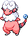
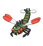
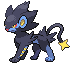
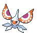
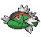
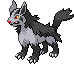

<table><tr><th colspan="1">Encounter Method</th><th colspan="5" style = "text-align: center;">Available Pokémon</th></tr>
<tr><td rowspan="2" style="vertical-align: middle; word-wrap: break-word; text-align: center;">Grass</td><td style="text-align: center; vertical-align: bottom;">    <a href="../../pokemons/507">Herdier</a>   Lv: 65   20.0% </td><td style="text-align: center; vertical-align: bottom;">    <a href="../../pokemons/520">Tranquill</a>   Lv: 64   20.0% </td><td style="text-align: center; vertical-align: bottom;">    <a href="../../pokemons/523">Zebstrika</a>   Lv: 66   10.0% </td><td style="text-align: center; vertical-align: bottom;">    <a href="../../pokemons/510">Liepard</a>   Lv: 66   10.0% </td><td style="text-align: center; vertical-align: bottom;">    <a href="../../pokemons/505">Watchog</a>   Lv: 66   10.0% </td></tr>
<tr><td style="text-align: center; vertical-align: bottom;">    <a href="../../pokemons/193">Yanma</a>   Lv: 64   10.0% </td><td style="text-align: center; vertical-align: bottom;">    <a href="../../pokemons/180">Flaaffy</a>   Lv: 64   5.0% </td><td style="text-align: center; vertical-align: bottom;">    <a href="../../pokemons/058">Growlithe</a>   Lv: 61   5.0% </td><td style="text-align: center; vertical-align: bottom;">    <a href="../../pokemons/274">Nuzleaf</a>   Lv: 65   5.0% </td><td style="text-align: center; vertical-align: bottom;">    <a href="../../pokemons/271">Lombre</a>   Lv: 65   5.0% </td></tr>
<tr><td rowspan="2" style="vertical-align: middle; word-wrap: break-word; text-align: center;">Dark Grass (Doubles)</td><td style="text-align: center; vertical-align: bottom;">    <a href="../../pokemons/507">Herdier</a>   Lv: 69   20.0% </td><td style="text-align: center; vertical-align: bottom;">    <a href="../../pokemons/520">Tranquill</a>   Lv: 68   20.0% </td><td style="text-align: center; vertical-align: bottom;">    <a href="../../pokemons/523">Zebstrika</a>   Lv: 70   10.0% </td><td style="text-align: center; vertical-align: bottom;">    <a href="../../pokemons/510">Liepard</a>   Lv: 70   10.0% </td><td style="text-align: center; vertical-align: bottom;">    <a href="../../pokemons/505">Watchog</a>   Lv: 70   10.0% </td></tr>
<tr><td style="text-align: center; vertical-align: bottom;">    <a href="../../pokemons/193">Yanma</a>   Lv: 69   10.0% </td><td style="text-align: center; vertical-align: bottom;">    <a href="../../pokemons/180">Flaaffy</a>   Lv: 69   5.0% </td><td style="text-align: center; vertical-align: bottom;">    <a href="../../pokemons/058">Growlithe</a>   Lv: 66   5.0% </td><td style="text-align: center; vertical-align: bottom;">    <a href="../../pokemons/274">Nuzleaf</a>   Lv: 69   5.0% </td><td style="text-align: center; vertical-align: bottom;">    <a href="../../pokemons/271">Lombre</a>   Lv: 69   5.0% </td></tr>
<tr><td rowspan="2" style="vertical-align: middle; word-wrap: break-word; text-align: center;">Shaking Grass</td><td style="text-align: center; vertical-align: bottom;">    <a href="../../pokemons/531">Audino</a>   Lv: 65   50.0% </td><td style="text-align: center; vertical-align: bottom;">    <a href="../../pokemons/531">Audino</a>   Lv: 66   10.0% </td><td style="text-align: center; vertical-align: bottom;">    <a href="../../pokemons/531">Audino</a>   Lv: 67   10.0% </td><td style="text-align: center; vertical-align: bottom;">    <a href="../../pokemons/531">Audino</a>   Lv: 68   10.0% </td><td style="text-align: center; vertical-align: bottom;">    <a href="../../pokemons/469">Yanmega</a>   Lv: 68   5.0% </td></tr>
<tr><td style="text-align: center; vertical-align: bottom;">    <a href="../../pokemons/272">Ludicolo</a>   Lv: 68   5.0% </td><td style="text-align: center; vertical-align: bottom;">    <a href="../../pokemons/275">Shiftry</a>   Lv: 68   5.0% </td><td style="text-align: center; vertical-align: bottom;">    <a href="../../pokemons/059">Arcanine</a>   Lv: 68   5.0% </td><td></td><td></td></tr>
<tr><td rowspan="1" style="vertical-align: middle; word-wrap: break-word; text-align: center;">Surf</td><td style="text-align: center; vertical-align: bottom;">    <a href="../../pokemons/270">Lotad</a>   Lv: 50-60   60.0% </td><td style="text-align: center; vertical-align: bottom;">    <a href="../../pokemons/550">Basculin-Blue</a>   Lv: 50-60   30.0% </td><td style="text-align: center; vertical-align: bottom;">    <a href="../../pokemons/271">Lombre</a>   Lv: 55-65   10.0% </td><td></td><td></td></tr>
<tr><td rowspan="1" style="vertical-align: middle; word-wrap: break-word; text-align: center;">Surf, Rippling Water</td><td style="text-align: center; vertical-align: bottom;">    <a href="../../pokemons/270">Lotad</a>   Lv: 55-65   60.0% </td><td style="text-align: center; vertical-align: bottom;">    <a href="../../pokemons/550">Basculin-Red</a>   Lv: 60-70   30.0% </td><td style="text-align: center; vertical-align: bottom;">    <a href="../../pokemons/271">Lombre</a>   Lv: 60-70   10.0% </td><td></td><td></td></tr>
<tr><td rowspan="1" style="vertical-align: middle; word-wrap: break-word; text-align: center;">Fish</td><td style="text-align: center; vertical-align: bottom;">    <a href="../../pokemons/341">Corphish</a>   Lv: 50-60   65.0% </td><td style="text-align: center; vertical-align: bottom;">    <a href="../../pokemons/550">Basculin-Blue</a>   Lv: 50-60   30.0% </td><td style="text-align: center; vertical-align: bottom;">    <a href="../../pokemons/342">Crawdaunt</a>   Lv: 55-65   5.0% </td><td></td><td></td></tr>
<tr><td rowspan="1" style="vertical-align: middle; word-wrap: break-word; text-align: center;">Fish, Rippling Water</td><td style="text-align: center; vertical-align: bottom;">    <a href="../../pokemons/341">Corphish</a>   Lv: 55-65   60.0% </td><td style="text-align: center; vertical-align: bottom;">    <a href="../../pokemons/550">Basculin-Red</a>   Lv: 65   30.0% </td><td style="text-align: center; vertical-align: bottom;">    <a href="../../pokemons/342">Crawdaunt</a>   Lv: 60-70   10.0% </td><td></td><td></td></tr>
<tr><td rowspan="2" style="vertical-align: middle; word-wrap: break-word; text-align: center;">Hidden Grotto: In the Dark, Doubles Grass</td><td style="text-align: center; vertical-align: bottom;">    <a href="../../pokemons/417">Pachirisu</a>   Lv: ??   3.75% </td><td style="text-align: center; vertical-align: bottom;">    <a href="../../pokemons/310">Manectric</a>   Lv: ??   3.75% </td><td style="text-align: center; vertical-align: bottom;">    <a href="../../pokemons/523">Zebstrika</a>   Lv: ??   3.75% </td><td style="text-align: center; vertical-align: bottom;">    <a href="../../pokemons/405">Luxray</a>   Lv: ??   3.75% </td><td style="text-align: center; vertical-align: bottom;">    <a href="../../pokemons/271">Lombre</a>   Lv: ??   2.0% </td></tr>
<tr><td style="text-align: center; vertical-align: bottom;">    <a href="../../pokemons/274">Nuzleaf</a>   Lv: ??   2.0% </td><td style="text-align: center; vertical-align: bottom;">    <a href="../../pokemons/038">Ninetales</a>   Lv: ??   0.5% </td><td style="text-align: center; vertical-align: bottom;">    <a href="../../pokemons/059">Arcanine</a>   Lv: ??   0.5% </td><td></td><td></td></tr>
<tr><td rowspan="2" style="vertical-align: middle; word-wrap: break-word; text-align: center;">Hidden Grotto: Over the Clear, Blue Pond</td><td style="text-align: center; vertical-align: bottom;">    <a href="../../pokemons/400">Bibarel</a>   Lv: ??   3.75% </td><td style="text-align: center; vertical-align: bottom;">    <a href="../../pokemons/048">Venonat</a>   Lv: ??   3.75% </td><td style="text-align: center; vertical-align: bottom;">    <a href="../../pokemons/271">Lombre</a>   Lv: ??   3.75% </td><td style="text-align: center; vertical-align: bottom;">    <a href="../../pokemons/284">Masquerain</a>   Lv: ??   3.75% </td><td style="text-align: center; vertical-align: bottom;">    <a href="../../pokemons/550">Basculin</a>   Lv: ??   2.0% </td></tr>
<tr><td style="text-align: center; vertical-align: bottom;">    <a href="../../pokemons/171">Lanturn</a>   Lv: ??   2.0% </td><td style="text-align: center; vertical-align: bottom;">    <a href="../../pokemons/180">Flaaffy</a>   Lv: ??   0.5% </td><td style="text-align: center; vertical-align: bottom;">    <a href="../../pokemons/262">Mightyena</a>   Lv: ??   0.5% </td><td></td><td></td></tr></table>