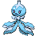

<table><tr><th colspan="1">Encounter Method</th><th colspan="5" style = "text-align: center;">Available Pokémon</th></tr>
<tr><td rowspan="2" style="vertical-align: middle; word-wrap: break-word; text-align: center;">Sand</td><td style="text-align: center; vertical-align: bottom;">    <a href="../../pokemons/557">Dwebble</a>   Lv: 19-20   20.0% </td><td style="text-align: center; vertical-align: bottom;">    <a href="../../pokemons/554">Darumaka</a>   Lv: 19-20   20.0% </td><td style="text-align: center; vertical-align: bottom;">    <a href="../../pokemons/551">Sandile</a>   Lv: 19-20   10.0% </td><td style="text-align: center; vertical-align: bottom;">    <a href="../../pokemons/559">Scraggy</a>   Lv: 19-20   10.0% </td><td style="text-align: center; vertical-align: bottom;">    <a href="../../pokemons/322">Numel</a>   Lv: 19-20   10.0% </td></tr>
<tr><td style="text-align: center; vertical-align: bottom;">    <a href="../../pokemons/027">Sandshrew</a>   Lv: 19-20   10.0% </td><td style="text-align: center; vertical-align: bottom;">    <a href="../../pokemons/449">Hippopotas</a>   Lv: 19-20   5.0% </td><td style="text-align: center; vertical-align: bottom;">    <a href="../../pokemons/331">Cacnea</a>   Lv: 19-20   5.0% </td><td style="text-align: center; vertical-align: bottom;">    <a href="../../pokemons/605">Elgyem</a>   Lv: 19-20   5.0% </td><td style="text-align: center; vertical-align: bottom;">    <a href="../../pokemons/328">Trapinch</a>   Lv: 19-20   5.0% </td></tr>
<tr><td rowspan="1" style="vertical-align: middle; word-wrap: break-word; text-align: center;">Surf</td><td style="text-align: center; vertical-align: bottom;">    <a href="../../pokemons/072">Tentacool</a>   Lv: 15-35   70.0% </td><td style="text-align: center; vertical-align: bottom;">    <a href="../../pokemons/592">Frillish</a>   Lv: 15-35   30.0% </td><td></td><td></td><td></td></tr>
<tr><td rowspan="1" style="vertical-align: middle; word-wrap: break-word; text-align: center;">Surf, Rippling Water</td><td style="text-align: center; vertical-align: bottom;">    <a href="../../pokemons/594">Alomomola</a>   Lv: 30-40   90.0% </td><td style="text-align: center; vertical-align: bottom;">    <a href="../../pokemons/073">Tentacruel</a>   Lv: 35-45   10.0% </td><td></td><td></td><td></td></tr>
<tr><td rowspan="1" style="vertical-align: middle; word-wrap: break-word; text-align: center;">Fish</td><td style="text-align: center; vertical-align: bottom;">    <a href="../../pokemons/369">Relicanth</a>   Lv: 10-20   60.0% </td><td style="text-align: center; vertical-align: bottom;">    <a href="../../pokemons/370">Luvdisc</a>   Lv: 10-20   30.0% </td><td style="text-align: center; vertical-align: bottom;">    <a href="../../pokemons/366">Clamperl</a>   Lv: 15-25   10.0% </td><td></td><td></td></tr>
<tr><td rowspan="1" style="vertical-align: middle; word-wrap: break-word; text-align: center;">Fish, Rippling Water</td><td style="text-align: center; vertical-align: bottom;">    <a href="../../pokemons/369">Relicanth</a>   Lv: 15-25   60.0% </td><td style="text-align: center; vertical-align: bottom;">    <a href="../../pokemons/370">Luvdisc</a>   Lv: 15-25   30.0% </td><td style="text-align: center; vertical-align: bottom;">    <a href="../../pokemons/366">Clamperl</a>   Lv: 15-25   10.0% </td><td></td><td></td></tr>
<tr><td rowspan="1" style="vertical-align: middle; word-wrap: break-word; text-align: center;">Special Event, BB2</td><td style="text-align: center; vertical-align: bottom;">    <a href="../../pokemons/630">Mandibuzz</a>   Lv: 30   100.0% </td><td></td><td></td><td></td><td></td></tr>
<tr><td rowspan="1" style="vertical-align: middle; word-wrap: break-word; text-align: center;">Special Event, VW2</td><td style="text-align: center; vertical-align: bottom;">    <a href="../../pokemons/628">Braviary</a>   Lv: 30   100.0% </td><td></td><td></td><td></td><td></td></tr></table>