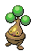
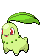
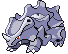

## Spring, Summer, Autumn

<table><tr><th colspan="1">Encounter Method</th><th colspan="5" style = "text-align: center;">Available Pokémon</th></tr>
<tr><td rowspan="2" style="vertical-align: middle; word-wrap: break-word; text-align: center;">Grass</td><td style="text-align: center; vertical-align: bottom;">    <a href="../../pokemons/585">Deerling</a>   Lv: 32-36   20.0% </td><td style="text-align: center; vertical-align: bottom;">    <a href="../../pokemons/590">Foongus</a>   Lv: 32-36   20.0% </td><td style="text-align: center; vertical-align: bottom;">    <a href="../../pokemons/193">Yanma</a>   Lv: 32-36   10.0% </td><td style="text-align: center; vertical-align: bottom;">    <a href="../../pokemons/616">Shelmet</a>   Lv: 32-36   10.0% </td><td style="text-align: center; vertical-align: bottom;">    <a href="../../pokemons/588">Karrablast</a>   Lv: 32-36   10.0% </td></tr>
<tr><td style="text-align: center; vertical-align: bottom;">    <a href="../../pokemons/017">Pidgeotto</a>   Lv: 32-36   10.0% </td><td style="text-align: center; vertical-align: bottom;">    <a href="../../pokemons/520">Tranquill</a>   Lv: 32-36   5.0% </td><td style="text-align: center; vertical-align: bottom;">    <a href="../../pokemons/183">Marill</a>   Lv: 32-36   5.0% </td><td style="text-align: center; vertical-align: bottom;">    <a href="../../pokemons/438">Bonsly</a>   Lv: 32-36   5.0% </td><td style="text-align: center; vertical-align: bottom;">    <a href="../../pokemons/439">Mime Jr.</a>   Lv: 32-36   5.0% </td></tr>
<tr><td rowspan="2" style="vertical-align: middle; word-wrap: break-word; text-align: center;">Dark Grass (Doubles)</td><td style="text-align: center; vertical-align: bottom;">    <a href="../../pokemons/585">Deerling</a>   Lv: 32-36   20.0% </td><td style="text-align: center; vertical-align: bottom;">    <a href="../../pokemons/590">Foongus</a>   Lv: 32-36   20.0% </td><td style="text-align: center; vertical-align: bottom;">    <a href="../../pokemons/520">Tranquill</a>   Lv: 32-36   10.0% </td><td style="text-align: center; vertical-align: bottom;">    <a href="../../pokemons/616">Shelmet</a>   Lv: 32-36   10.0% </td><td style="text-align: center; vertical-align: bottom;">    <a href="../../pokemons/588">Karrablast</a>   Lv: 32-36   10.0% </td></tr>
<tr><td style="text-align: center; vertical-align: bottom;">    <a href="../../pokemons/017">Pidgeotto</a>   Lv: 32-36   10.0% </td><td style="text-align: center; vertical-align: bottom;">    <a href="../../pokemons/185">Sudowoodo</a>   Lv: 32-36   5.0% </td><td style="text-align: center; vertical-align: bottom;">    <a href="../../pokemons/122">Mr. Mime</a>   Lv: 32-36   5.0% </td><td style="text-align: center; vertical-align: bottom;">    <a href="../../pokemons/183">Marill</a>   Lv: 32-36   5.0% </td><td style="text-align: center; vertical-align: bottom;">    <a href="../../pokemons/193">Yanma</a>   Lv: 32-36   5.0% </td></tr>
<tr><td rowspan="2" style="vertical-align: middle; word-wrap: break-word; text-align: center;">Shaking Grass</td><td style="text-align: center; vertical-align: bottom;">    <a href="../../pokemons/531">Audino</a>   Lv: 32-36   60.0% </td><td style="text-align: center; vertical-align: bottom;">    <a href="../../pokemons/587">Emolga</a>   Lv: 32-36   10.0% </td><td style="text-align: center; vertical-align: bottom;">    <a href="../../pokemons/206">Dunsparce</a>   Lv: 32-36   10.0% </td><td style="text-align: center; vertical-align: bottom;">    <a href="../../pokemons/521">Unfezant</a>   Lv: 32-36   5.0% </td><td style="text-align: center; vertical-align: bottom;">    <a href="../../pokemons/351">Castform</a>   Lv: 32-36   5.0% </td></tr>
<tr><td style="text-align: center; vertical-align: bottom;">    <a href="../../pokemons/469">Yanmega</a>   Lv: 32-36   5.0% </td><td style="text-align: center; vertical-align: bottom;">    <a href="../../pokemons/184">Azumarill</a>   Lv: 32-36   5.0% </td><td></td><td></td><td></td></tr>
<tr><td rowspan="1" style="vertical-align: middle; word-wrap: break-word; text-align: center;">Surf</td><td style="text-align: center; vertical-align: bottom;">    <a href="../../pokemons/550">Basculin-Red</a>   Lv: 30   70.0% </td><td style="text-align: center; vertical-align: bottom;">    <a href="../../pokemons/183">Marill</a>   Lv: 30   30.0% </td><td></td><td></td><td></td></tr>
<tr><td rowspan="1" style="vertical-align: middle; word-wrap: break-word; text-align: center;">Surf, Rippling Water</td><td style="text-align: center; vertical-align: bottom;">    <a href="../../pokemons/550">Basculin-Blue</a>   Lv: 30   90.0% </td><td style="text-align: center; vertical-align: bottom;">    <a href="../../pokemons/184">Azumarill</a>   Lv: 30   10.0% </td><td></td><td></td><td></td></tr>
<tr><td rowspan="1" style="vertical-align: middle; word-wrap: break-word; text-align: center;">Fish</td><td style="text-align: center; vertical-align: bottom;">    <a href="../../pokemons/170">Chinchou</a>   Lv: 25   60.0% </td><td style="text-align: center; vertical-align: bottom;">    <a href="../../pokemons/072">Tentacool</a>   Lv: 25   30.0% </td><td style="text-align: center; vertical-align: bottom;">    <a href="../../pokemons/339">Barboach</a>   Lv: 25   10.0% </td><td></td><td></td></tr>
<tr><td rowspan="1" style="vertical-align: middle; word-wrap: break-word; text-align: center;">Fish, Rippling Water</td><td style="text-align: center; vertical-align: bottom;">    <a href="../../pokemons/072">Tentacool</a>   Lv: 30   60.0% </td><td style="text-align: center; vertical-align: bottom;">    <a href="../../pokemons/170">Chinchou</a>   Lv: 30   30.0% </td><td style="text-align: center; vertical-align: bottom;">    <a href="../../pokemons/339">Barboach</a>   Lv: 30   10.0% </td><td></td><td></td></tr>
<tr><td rowspan="3" style="vertical-align: middle; word-wrap: break-word; text-align: center;">Hidden Grotto: Driftveil Entrance</td><td style="text-align: center; vertical-align: bottom;">    <a href="../../pokemons/285">Shroomish</a>   Lv: ??   3.75% </td><td style="text-align: center; vertical-align: bottom;">    <a href="../../pokemons/163">Hoothoot</a>   Lv: ??   3.75% </td><td style="text-align: center; vertical-align: bottom;">    <a href="../../pokemons/177">Natu</a>   Lv: ??   3.75% </td><td style="text-align: center; vertical-align: bottom;">    <a href="../../pokemons/056">Mankey</a>   Lv: ??   3.75% </td><td style="text-align: center; vertical-align: bottom;">    <a href="../../pokemons/535">Tympole</a>   Lv: ??   1.0% </td></tr>
<tr><td style="text-align: center; vertical-align: bottom;">    <a href="../../pokemons/439">Mime Jr.</a>   Lv: ??   1.0% </td><td style="text-align: center; vertical-align: bottom;">    <a href="../../pokemons/438">Bonsly</a>   Lv: ??   1.0% </td><td style="text-align: center; vertical-align: bottom;">    <a href="../../pokemons/193">Yanma</a>   Lv: ??   1.0% </td><td style="text-align: center; vertical-align: bottom;">    <a href="../../pokemons/459">Snover</a>   Lv: ??   0.33% </td><td style="text-align: center; vertical-align: bottom;">    <a href="../../pokemons/152">Chikorita</a>   Lv: ??   0.33% </td></tr>
<tr><td style="text-align: center; vertical-align: bottom;">    <a href="../../pokemons/387">Turtwig</a>   Lv: ??   0.33% </td><td></td><td></td><td></td><td></td></tr>
<tr><td rowspan="3" style="vertical-align: middle; word-wrap: break-word; text-align: center;">Hidden Grotto:  Mistralton Cave Entrance</td><td style="text-align: center; vertical-align: bottom;">    <a href="../../pokemons/111">Rhyhorn</a>   Lv: ??   3.75% </td><td style="text-align: center; vertical-align: bottom;">    <a href="../../pokemons/095">Onix</a>   Lv: ??   3.75% </td><td style="text-align: center; vertical-align: bottom;">    <a href="../../pokemons/293">Whismur</a>   Lv: ??   3.75% </td><td style="text-align: center; vertical-align: bottom;">    <a href="../../pokemons/074">Geodude</a>   Lv: ??   3.75% </td><td style="text-align: center; vertical-align: bottom;">    <a href="../../pokemons/533">Gurdurr</a>   Lv: ??   1.0% </td></tr>
<tr><td style="text-align: center; vertical-align: bottom;">    <a href="../../pokemons/304">Aron</a>   Lv: ??   1.0% </td><td style="text-align: center; vertical-align: bottom;">    <a href="../../pokemons/299">Nosepass</a>   Lv: ??   1.0% </td><td style="text-align: center; vertical-align: bottom;">    <a href="../../pokemons/236">Tyrogue</a>   Lv: ??   1.0% </td><td style="text-align: center; vertical-align: bottom;">    <a href="../../pokemons/443">Gible</a>   Lv: ??   0.33% </td><td style="text-align: center; vertical-align: bottom;">    <a href="../../pokemons/155">Cyndaquil</a>   Lv: ??   0.33% </td></tr>
<tr><td style="text-align: center; vertical-align: bottom;">    <a href="../../pokemons/255">Torchic</a>   Lv: ??   0.33% </td><td></td><td></td><td></td><td></td></tr>
<tr><td rowspan="1" style="vertical-align: middle; word-wrap: break-word; text-align: center;">Special Gifts</td><td style="text-align: center; vertical-align: bottom;">    <a href="../../pokemons/222">Corsola</a>   Lv: 30   100.0% </td><td></td><td></td><td></td><td></td></tr></table>
## Winter

<table><tr><th colspan="1">Encounter Method</th><th colspan="5" style = "text-align: center;">Available Pokémon</th></tr>
<tr><td rowspan="2" style="vertical-align: middle; word-wrap: break-word; text-align: center;">Grass</td><td style="text-align: center; vertical-align: bottom;">    <a href="../../pokemons/585">Deerling</a>   Lv: 32-36   20.0% </td><td style="text-align: center; vertical-align: bottom;">    <a href="../../pokemons/590">Foongus</a>   Lv: 32-36   20.0% </td><td style="text-align: center; vertical-align: bottom;">    <a href="../../pokemons/582">Vanillite</a>   Lv: 32-36   10.0% </td><td style="text-align: center; vertical-align: bottom;">    <a href="../../pokemons/616">Shelmet</a>   Lv: 32-36   10.0% </td><td style="text-align: center; vertical-align: bottom;">    <a href="../../pokemons/588">Karrablast</a>   Lv: 32-36   10.0% </td></tr>
<tr><td style="text-align: center; vertical-align: bottom;">    <a href="../../pokemons/459">Snover</a>   Lv: 32-36   10.0% </td><td style="text-align: center; vertical-align: bottom;">    <a href="../../pokemons/193">Yanma</a>   Lv: 32-36   5.0% </td><td style="text-align: center; vertical-align: bottom;">    <a href="../../pokemons/183">Marill</a>   Lv: 32-36   5.0% </td><td style="text-align: center; vertical-align: bottom;">    <a href="../../pokemons/438">Bonsly</a>   Lv: 32-36   5.0% </td><td></td></tr>
<tr><td rowspan="2" style="vertical-align: middle; word-wrap: break-word; text-align: center;">Dark Grass (Doubles)</td><td style="text-align: center; vertical-align: bottom;">    <a href="../../pokemons/585">Deerling</a>   Lv: 32-36   20.0% </td><td style="text-align: center; vertical-align: bottom;">    <a href="../../pokemons/590">Foongus</a>   Lv: 32-36   20.0% </td><td style="text-align: center; vertical-align: bottom;">    <a href="../../pokemons/582">Vanillite</a>   Lv: 32-36   10.0% </td><td style="text-align: center; vertical-align: bottom;">    <a href="../../pokemons/616">Shelmet</a>   Lv: 32-36   10.0% </td><td style="text-align: center; vertical-align: bottom;">    <a href="../../pokemons/588">Karrablast</a>   Lv: 32-36   10.0% </td></tr>
<tr><td style="text-align: center; vertical-align: bottom;">    <a href="../../pokemons/459">Snover</a>   Lv: 32-36   10.0% </td><td style="text-align: center; vertical-align: bottom;">    <a href="../../pokemons/185">Sudowoodo</a>   Lv: 32-36   5.0% </td><td style="text-align: center; vertical-align: bottom;">    <a href="../../pokemons/122">Mr. Mime</a>   Lv: 32-36   5.0% </td><td style="text-align: center; vertical-align: bottom;">    <a href="../../pokemons/183">Marill</a>   Lv: 32-36   5.0% </td><td style="text-align: center; vertical-align: bottom;">    <a href="../../pokemons/193">Yanma</a>   Lv: 32-36   5.0% </td></tr>
<tr><td rowspan="2" style="vertical-align: middle; word-wrap: break-word; text-align: center;">Shaking Grass</td><td style="text-align: center; vertical-align: bottom;">    <a href="../../pokemons/531">Audino</a>   Lv: 32-36   65.0% </td><td style="text-align: center; vertical-align: bottom;">    <a href="../../pokemons/587">Emolga</a>   Lv: 32-36   10.0% </td><td style="text-align: center; vertical-align: bottom;">    <a href="../../pokemons/206">Dunsparce</a>   Lv: 32-36   10.0% </td><td style="text-align: center; vertical-align: bottom;">    <a href="../../pokemons/184">Azumarill</a>   Lv: 32-36   5.0% </td><td style="text-align: center; vertical-align: bottom;">    <a href="../../pokemons/351">Castform</a>   Lv: 32-36   5.0% </td></tr>
<tr><td style="text-align: center; vertical-align: bottom;">    <a href="../../pokemons/469">Yanmega</a>   Lv: 32-36   5.0% </td><td></td><td></td><td></td><td></td></tr>
<tr><td rowspan="1" style="vertical-align: middle; word-wrap: break-word; text-align: center;">Surf</td><td style="text-align: center; vertical-align: bottom;">    <a href="../../pokemons/550">Basculin-Red</a>   Lv: 30   70.0% </td><td style="text-align: center; vertical-align: bottom;">    <a href="../../pokemons/086">Seel</a>   Lv: 30   30.0% </td><td></td><td></td><td></td></tr>
<tr><td rowspan="1" style="vertical-align: middle; word-wrap: break-word; text-align: center;">Surf, Rippling Water</td><td style="text-align: center; vertical-align: bottom;">    <a href="../../pokemons/550">Basculin-Blue</a>   Lv: 30   90.0% </td><td style="text-align: center; vertical-align: bottom;">    <a href="../../pokemons/087">Dewgong</a>   Lv: 30   10.0% </td><td></td><td></td><td></td></tr>
<tr><td rowspan="1" style="vertical-align: middle; word-wrap: break-word; text-align: center;">Fish</td><td style="text-align: center; vertical-align: bottom;">    <a href="../../pokemons/170">Chinchou</a>   Lv: 25   60.0% </td><td style="text-align: center; vertical-align: bottom;">    <a href="../../pokemons/072">Tentacool</a>   Lv: 25   30.0% </td><td style="text-align: center; vertical-align: bottom;">    <a href="../../pokemons/339">Barboach</a>   Lv: 25   10.0% </td><td></td><td></td></tr>
<tr><td rowspan="1" style="vertical-align: middle; word-wrap: break-word; text-align: center;">Fish, Rippling Water</td><td style="text-align: center; vertical-align: bottom;">    <a href="../../pokemons/072">Tentacool</a>   Lv: 30   60.0% </td><td style="text-align: center; vertical-align: bottom;">    <a href="../../pokemons/170">Chinchou</a>   Lv: 30   30.0% </td><td style="text-align: center; vertical-align: bottom;">    <a href="../../pokemons/339">Barboach</a>   Lv: 30   10.0% </td><td></td><td></td></tr>
<tr><td rowspan="3" style="vertical-align: middle; word-wrap: break-word; text-align: center;">Hidden Grotto: Driftveil Entrance</td><td style="text-align: center; vertical-align: bottom;">    <a href="../../pokemons/285">Shroomish</a>   Lv: ??   3.75% </td><td style="text-align: center; vertical-align: bottom;">    <a href="../../pokemons/163">Hoothoot</a>   Lv: ??   3.75% </td><td style="text-align: center; vertical-align: bottom;">    <a href="../../pokemons/177">Natu</a>   Lv: ??   3.75% </td><td style="text-align: center; vertical-align: bottom;">    <a href="../../pokemons/056">Mankey</a>   Lv: ??   3.75% </td><td style="text-align: center; vertical-align: bottom;">    <a href="../../pokemons/535">Tympole</a>   Lv: ??   1.0% </td></tr>
<tr><td style="text-align: center; vertical-align: bottom;">    <a href="../../pokemons/439">Mime Jr.</a>   Lv: ??   1.0% </td><td style="text-align: center; vertical-align: bottom;">    <a href="../../pokemons/438">Bonsly</a>   Lv: ??   1.0% </td><td style="text-align: center; vertical-align: bottom;">    <a href="../../pokemons/193">Yanma</a>   Lv: ??   1.0% </td><td style="text-align: center; vertical-align: bottom;">    <a href="../../pokemons/459">Snover</a>   Lv: ??   0.33% </td><td style="text-align: center; vertical-align: bottom;">    <a href="../../pokemons/152">Chikorita</a>   Lv: ??   0.33% </td></tr>
<tr><td style="text-align: center; vertical-align: bottom;">    <a href="../../pokemons/387">Turtwig</a>   Lv: ??   0.33% </td><td></td><td></td><td></td><td></td></tr>
<tr><td rowspan="3" style="vertical-align: middle; word-wrap: break-word; text-align: center;">Hidden Grotto:  Mistralton Cave Entrance</td><td style="text-align: center; vertical-align: bottom;">    <a href="../../pokemons/111">Rhyhorn</a>   Lv: ??   3.75% </td><td style="text-align: center; vertical-align: bottom;">    <a href="../../pokemons/095">Onix</a>   Lv: ??   3.75% </td><td style="text-align: center; vertical-align: bottom;">    <a href="../../pokemons/293">Whismur</a>   Lv: ??   3.75% </td><td style="text-align: center; vertical-align: bottom;">    <a href="../../pokemons/074">Geodude</a>   Lv: ??   3.75% </td><td style="text-align: center; vertical-align: bottom;">    <a href="../../pokemons/533">Gurdurr</a>   Lv: ??   1.0% </td></tr>
<tr><td style="text-align: center; vertical-align: bottom;">    <a href="../../pokemons/304">Aron</a>   Lv: ??   1.0% </td><td style="text-align: center; vertical-align: bottom;">    <a href="../../pokemons/299">Nosepass</a>   Lv: ??   1.0% </td><td style="text-align: center; vertical-align: bottom;">    <a href="../../pokemons/236">Tyrogue</a>   Lv: ??   1.0% </td><td style="text-align: center; vertical-align: bottom;">    <a href="../../pokemons/443">Gible</a>   Lv: ??   0.33% </td><td style="text-align: center; vertical-align: bottom;">    <a href="../../pokemons/155">Cyndaquil</a>   Lv: ??   0.33% </td></tr>
<tr><td style="text-align: center; vertical-align: bottom;">    <a href="../../pokemons/255">Torchic</a>   Lv: ??   0.33% </td><td></td><td></td><td></td><td></td></tr>
<tr><td rowspan="1" style="vertical-align: middle; word-wrap: break-word; text-align: center;">Special Gifts</td><td style="text-align: center; vertical-align: bottom;">    <a href="../../pokemons/222">Corsola</a>   Lv: 30   100.0% </td><td></td><td></td><td></td><td></td></tr></table>
