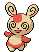
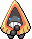

## Spring, Summer, Autumn

<table><tr><th colspan="1">Encounter Method</th><th colspan="5" style = "text-align: center;">Available Pokémon</th></tr>
<tr><td rowspan="3" style="vertical-align: middle; word-wrap: break-word; text-align: center;">Grass</td><td style="text-align: center; vertical-align: bottom;">    <a href="../../pokemons/193">Yanma</a>   Lv: 38-41   20.0% </td><td style="text-align: center; vertical-align: bottom;">    <a href="../../pokemons/523">Zebstrika</a>   Lv: 38-41   20.0% </td><td style="text-align: center; vertical-align: bottom;">    <a href="../../pokemons/585">Deerling</a>   Lv: 38-41   10.0% </td><td style="text-align: center; vertical-align: bottom;">    <a href="../../pokemons/505">Watchog</a>   Lv: 38-41   10.0% </td><td style="text-align: center; vertical-align: bottom;">    <a href="../../pokemons/231">Phanpy</a>   Lv: 38-41   10.0% </td></tr>
<tr><td style="text-align: center; vertical-align: bottom;">    <a href="../../pokemons/190">Aipom</a>   Lv: 38-41   10.0% </td><td style="text-align: center; vertical-align: bottom;">    <a href="../../pokemons/162">Furret</a>   Lv: 38-41   5.0% </td><td style="text-align: center; vertical-align: bottom;">    <a href="../../pokemons/352">Kecleon</a>   Lv: 38-41   5.0% </td><td style="text-align: center; vertical-align: bottom;">    <a href="../../pokemons/335">Zangoose</a>   Lv: 38-41   4.0% </td><td style="text-align: center; vertical-align: bottom;">    <a href="../../pokemons/336">Seviper</a>   Lv: 38-41   4.0% </td></tr>
<tr><td style="text-align: center; vertical-align: bottom;">    <a href="../../pokemons/327">Spinda</a>   Lv: 38-41   2.0% </td><td></td><td></td><td></td><td></td></tr>
<tr><td rowspan="3" style="vertical-align: middle; word-wrap: break-word; text-align: center;">Dark Grass (Doubles)</td><td style="text-align: center; vertical-align: bottom;">    <a href="../../pokemons/193">Yanma</a>   Lv: 38-42   20.0% </td><td style="text-align: center; vertical-align: bottom;">    <a href="../../pokemons/523">Zebstrika</a>   Lv: 38-42   20.0% </td><td style="text-align: center; vertical-align: bottom;">    <a href="../../pokemons/586">Sawsbuck</a>   Lv: 38-42   10.0% </td><td style="text-align: center; vertical-align: bottom;">    <a href="../../pokemons/505">Watchog</a>   Lv: 38-42   10.0% </td><td style="text-align: center; vertical-align: bottom;">    <a href="../../pokemons/232">Donphan</a>   Lv: 38-42   10.0% </td></tr>
<tr><td style="text-align: center; vertical-align: bottom;">    <a href="../../pokemons/190">Aipom</a>   Lv: 38-42   10.0% </td><td style="text-align: center; vertical-align: bottom;">    <a href="../../pokemons/162">Furret</a>   Lv: 38-42   5.0% </td><td style="text-align: center; vertical-align: bottom;">    <a href="../../pokemons/352">Kecleon</a>   Lv: 38-42   5.0% </td><td style="text-align: center; vertical-align: bottom;">    <a href="../../pokemons/335">Zangoose</a>   Lv: 38-42   4.0% </td><td style="text-align: center; vertical-align: bottom;">    <a href="../../pokemons/336">Seviper</a>   Lv: 38-42   4.0% </td></tr>
<tr><td style="text-align: center; vertical-align: bottom;">    <a href="../../pokemons/327">Spinda</a>   Lv: 38-42   2.0% </td><td></td><td></td><td></td><td></td></tr>
<tr><td rowspan="1" style="vertical-align: middle; word-wrap: break-word; text-align: center;">Shaking Grass</td><td style="text-align: center; vertical-align: bottom;">    <a href="../../pokemons/531">Audino</a>   Lv: 43-47   100.0% </td><td></td><td></td><td></td><td></td></tr>
<tr><td rowspan="3" style="vertical-align: middle; word-wrap: break-word; text-align: center;">Hidden Grotto</td><td style="text-align: center; vertical-align: bottom;">    <a href="../../pokemons/220">Swinub</a>   Lv: ??   3.75% </td><td style="text-align: center; vertical-align: bottom;">    <a href="../../pokemons/361">Snorunt</a>   Lv: ??   3.75% </td><td style="text-align: center; vertical-align: bottom;">    <a href="../../pokemons/231">Phanpy</a>   Lv: ??   3.75% </td><td style="text-align: center; vertical-align: bottom;">    <a href="../../pokemons/190">Aipom</a>   Lv: ??   3.75% </td><td style="text-align: center; vertical-align: bottom;">    <a href="../../pokemons/613">Cubchoo</a>   Lv: ??   1.0% </td></tr>
<tr><td style="text-align: center; vertical-align: bottom;">    <a href="../../pokemons/327">Spinda</a>   Lv: ??   1.0% </td><td style="text-align: center; vertical-align: bottom;">    <a href="../../pokemons/335">Zangoose</a>   Lv: ??   1.0% </td><td style="text-align: center; vertical-align: bottom;">    <a href="../../pokemons/336">Seviper</a>   Lv: ??   1.0% </td><td style="text-align: center; vertical-align: bottom;">    <a href="../../pokemons/215">Sneasel</a>   Lv: ??   0.33% </td><td style="text-align: center; vertical-align: bottom;">    <a href="../../pokemons/004">Charmander</a>   Lv: ??   0.33% </td></tr>
<tr><td style="text-align: center; vertical-align: bottom;">    <a href="../../pokemons/390">Chimchar</a>   Lv: ??   0.33% </td><td></td><td></td><td></td><td></td></tr></table>
## Winter

<table><tr><th colspan="1">Encounter Method</th><th colspan="5" style = "text-align: center;">Available Pokémon</th></tr>
<tr><td rowspan="3" style="vertical-align: middle; word-wrap: break-word; text-align: center;">Grass</td><td style="text-align: center; vertical-align: bottom;">    <a href="../../pokemons/613">Cubchoo</a>   Lv: 38-41   20.0% </td><td style="text-align: center; vertical-align: bottom;">    <a href="../../pokemons/523">Zebstrika</a>   Lv: 38-41   20.0% </td><td style="text-align: center; vertical-align: bottom;">    <a href="../../pokemons/585">Deerling</a>   Lv: 38-41   10.0% </td><td style="text-align: center; vertical-align: bottom;">    <a href="../../pokemons/505">Watchog</a>   Lv: 38-41   10.0% </td><td style="text-align: center; vertical-align: bottom;">    <a href="../../pokemons/231">Phanpy</a>   Lv: 38-41   10.0% </td></tr>
<tr><td style="text-align: center; vertical-align: bottom;">    <a href="../../pokemons/190">Aipom</a>   Lv: 38-41   10.0% </td><td style="text-align: center; vertical-align: bottom;">    <a href="../../pokemons/361">Snorunt</a>   Lv: 38-41   5.0% </td><td style="text-align: center; vertical-align: bottom;">    <a href="../../pokemons/215">Sneasel</a>   Lv: 38-41   5.0% </td><td style="text-align: center; vertical-align: bottom;">    <a href="../../pokemons/335">Zangoose</a>   Lv: 38-41   4.0% </td><td style="text-align: center; vertical-align: bottom;">    <a href="../../pokemons/336">Seviper</a>   Lv: 38-41   4.0% </td></tr>
<tr><td style="text-align: center; vertical-align: bottom;">    <a href="../../pokemons/327">Spinda</a>   Lv: 38-41   2.0% </td><td></td><td></td><td></td><td></td></tr>
<tr><td rowspan="3" style="vertical-align: middle; word-wrap: break-word; text-align: center;">Dark Grass (Doubles)</td><td style="text-align: center; vertical-align: bottom;">    <a href="../../pokemons/614">Beartic</a>   Lv: 38-42   20.0% </td><td style="text-align: center; vertical-align: bottom;">    <a href="../../pokemons/523">Zebstrika</a>   Lv: 38-42   20.0% </td><td style="text-align: center; vertical-align: bottom;">    <a href="../../pokemons/586">Sawsbuck</a>   Lv: 38-42   10.0% </td><td style="text-align: center; vertical-align: bottom;">    <a href="../../pokemons/505">Watchog</a>   Lv: 38-42   10.0% </td><td style="text-align: center; vertical-align: bottom;">    <a href="../../pokemons/232">Donphan</a>   Lv: 38-42   10.0% </td></tr>
<tr><td style="text-align: center; vertical-align: bottom;">    <a href="../../pokemons/190">Aipom</a>   Lv: 38-42   10.0% </td><td style="text-align: center; vertical-align: bottom;">    <a href="../../pokemons/361">Snorunt</a>   Lv: 38-42   5.0% </td><td style="text-align: center; vertical-align: bottom;">    <a href="../../pokemons/215">Sneasel</a>   Lv: 38-42   5.0% </td><td style="text-align: center; vertical-align: bottom;">    <a href="../../pokemons/335">Zangoose</a>   Lv: 38-42   4.0% </td><td style="text-align: center; vertical-align: bottom;">    <a href="../../pokemons/336">Seviper</a>   Lv: 38-42   4.0% </td></tr>
<tr><td style="text-align: center; vertical-align: bottom;">    <a href="../../pokemons/327">Spinda</a>   Lv: 38-42   2.0% </td><td></td><td></td><td></td><td></td></tr>
<tr><td rowspan="1" style="vertical-align: middle; word-wrap: break-word; text-align: center;">Shaking Grass</td><td style="text-align: center; vertical-align: bottom;">    <a href="../../pokemons/531">Audino</a>   Lv: 43-47   100.0% </td><td></td><td></td><td></td><td></td></tr>
<tr><td rowspan="3" style="vertical-align: middle; word-wrap: break-word; text-align: center;">Hidden Grotto</td><td style="text-align: center; vertical-align: bottom;">    <a href="../../pokemons/220">Swinub</a>   Lv: ??   3.75% </td><td style="text-align: center; vertical-align: bottom;">    <a href="../../pokemons/361">Snorunt</a>   Lv: ??   3.75% </td><td style="text-align: center; vertical-align: bottom;">    <a href="../../pokemons/231">Phanpy</a>   Lv: ??   3.75% </td><td style="text-align: center; vertical-align: bottom;">    <a href="../../pokemons/190">Aipom</a>   Lv: ??   3.75% </td><td style="text-align: center; vertical-align: bottom;">    <a href="../../pokemons/613">Cubchoo</a>   Lv: ??   1.0% </td></tr>
<tr><td style="text-align: center; vertical-align: bottom;">    <a href="../../pokemons/327">Spinda</a>   Lv: ??   1.0% </td><td style="text-align: center; vertical-align: bottom;">    <a href="../../pokemons/335">Zangoose</a>   Lv: ??   1.0% </td><td style="text-align: center; vertical-align: bottom;">    <a href="../../pokemons/336">Seviper</a>   Lv: ??   1.0% </td><td style="text-align: center; vertical-align: bottom;">    <a href="../../pokemons/215">Sneasel</a>   Lv: ??   0.33% </td><td style="text-align: center; vertical-align: bottom;">    <a href="../../pokemons/004">Charmander</a>   Lv: ??   0.33% </td></tr>
<tr><td style="text-align: center; vertical-align: bottom;">    <a href="../../pokemons/390">Chimchar</a>   Lv: ??   0.33% </td><td></td><td></td><td></td><td></td></tr></table>
