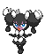
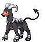
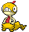
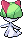

<table><tr><th colspan="1">Encounter Method</th><th colspan="5" style = "text-align: center;">Available Pokémon</th></tr>
<tr><td rowspan="2" style="vertical-align: middle; word-wrap: break-word; text-align: center;">Grass</td><td style="text-align: center; vertical-align: bottom;">    <a href="../../pokemons/261">Poochyena</a>   Lv: 49-51   20.0% </td><td style="text-align: center; vertical-align: bottom;">    <a href="../../pokemons/228">Houndour</a>   Lv: 49-51   20.0% </td><td style="text-align: center; vertical-align: bottom;">    <a href="../../pokemons/569">Garbodor</a>   Lv: 49-51   10.0% </td><td style="text-align: center; vertical-align: bottom;">    <a href="../../pokemons/575">Gothorita</a>   Lv: 49-51   10.0% </td><td style="text-align: center; vertical-align: bottom;">    <a href="../../pokemons/578">Duosion</a>   Lv: 49-51   10.0% </td></tr>
<tr><td style="text-align: center; vertical-align: bottom;">    <a href="../../pokemons/317">Swalot</a>   Lv: 49-51   10.0% </td><td style="text-align: center; vertical-align: bottom;">    <a href="../../pokemons/625">Bisharp</a>   Lv: 49-51   5.0% </td><td style="text-align: center; vertical-align: bottom;">    <a href="../../pokemons/070">Weepinbell</a>   Lv: 49-51   5.0% </td><td style="text-align: center; vertical-align: bottom;">    <a href="../../pokemons/281">Kirlia</a>   Lv: 49-51   5.0% </td><td style="text-align: center; vertical-align: bottom;">    <a href="../../pokemons/446">Munchlax</a>   Lv: 49-51   5.0% </td></tr>
<tr><td rowspan="2" style="vertical-align: middle; word-wrap: break-word; text-align: center;">Dark Grass (Doubles)</td><td style="text-align: center; vertical-align: bottom;">    <a href="../../pokemons/262">Mightyena</a>   Lv: 50-52   20.0% </td><td style="text-align: center; vertical-align: bottom;">    <a href="../../pokemons/229">Houndoom</a>   Lv: 50-52   20.0% </td><td style="text-align: center; vertical-align: bottom;">    <a href="../../pokemons/569">Garbodor</a>   Lv: 50-52   10.0% </td><td style="text-align: center; vertical-align: bottom;">    <a href="../../pokemons/575">Gothorita</a>   Lv: 50-52   10.0% </td><td style="text-align: center; vertical-align: bottom;">    <a href="../../pokemons/578">Duosion</a>   Lv: 50-52   10.0% </td></tr>
<tr><td style="text-align: center; vertical-align: bottom;">    <a href="../../pokemons/317">Swalot</a>   Lv: 50-52   10.0% </td><td style="text-align: center; vertical-align: bottom;">    <a href="../../pokemons/281">Kirlia</a>   Lv: 50-52   10.0% </td><td style="text-align: center; vertical-align: bottom;">    <a href="../../pokemons/071">Victreebel</a>   Lv: 50-52   10.0% </td><td></td><td></td></tr>
<tr><td rowspan="1" style="vertical-align: middle; word-wrap: break-word; text-align: center;">Shaking Grass</td><td style="text-align: center; vertical-align: bottom;">    <a href="../../pokemons/531">Audino</a>   Lv: 53-56   70.0% </td><td style="text-align: center; vertical-align: bottom;">    <a href="../../pokemons/587">Emolga</a>   Lv: 53-56   20.0% </td><td style="text-align: center; vertical-align: bottom;">    <a href="../../pokemons/576">Gothitelle</a>   Lv: 53-56   5.0% </td><td style="text-align: center; vertical-align: bottom;">    <a href="../../pokemons/579">Reuniclus</a>   Lv: 53-56   5.0% </td><td></td></tr>
<tr><td rowspan="3" style="vertical-align: middle; word-wrap: break-word; text-align: center;">Hidden Grotto</td><td style="text-align: center; vertical-align: bottom;">    <a href="../../pokemons/453">Croagunk</a>   Lv: ??   3.75% </td><td style="text-align: center; vertical-align: bottom;">    <a href="../../pokemons/559">Scraggy</a>   Lv: ??   3.75% </td><td style="text-align: center; vertical-align: bottom;">    <a href="../../pokemons/261">Poochyena</a>   Lv: ??   3.75% </td><td style="text-align: center; vertical-align: bottom;">    <a href="../../pokemons/316">Gulpin</a>   Lv: ??   3.75% </td><td style="text-align: center; vertical-align: bottom;">    <a href="../../pokemons/069">Bellsprout</a>   Lv: ??   1.0% </td></tr>
<tr><td style="text-align: center; vertical-align: bottom;">    <a href="../../pokemons/621">Druddigon</a>   Lv: ??   1.0% </td><td style="text-align: center; vertical-align: bottom;">    <a href="../../pokemons/228">Houndour</a>   Lv: ??   1.0% </td><td style="text-align: center; vertical-align: bottom;">    <a href="../../pokemons/088">Grimer</a>   Lv: ??   1.0% </td><td style="text-align: center; vertical-align: bottom;">    <a href="../../pokemons/280">Ralts</a>   Lv: ??   0.25% </td><td style="text-align: center; vertical-align: bottom;">    <a href="../../pokemons/081">Magnemite</a>   Lv: ??   0.25% </td></tr>
<tr><td style="text-align: center; vertical-align: bottom;">    <a href="../../pokemons/622">Golett</a>   Lv: ??   0.25% </td><td style="text-align: center; vertical-align: bottom;">    <a href="../../pokemons/446">Munchlax</a>   Lv: ??   0.25% </td><td></td><td></td><td></td></tr></table>