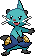
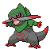
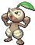
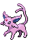

<table><tr><th colspan="1">Encounter Method</th><th colspan="5" style = "text-align: center;">Available Pokémon</th></tr>
<tr><td rowspan="2" style="vertical-align: middle; word-wrap: break-word; text-align: center;">Grass</td><td style="text-align: center; vertical-align: bottom;">    <a href="../../pokemons/496">Servine</a>   Lv: 17-100   20.0% </td><td style="text-align: center; vertical-align: bottom;">    <a href="../../pokemons/499">Pignite</a>   Lv: 17-100   20.0% </td><td style="text-align: center; vertical-align: bottom;">    <a href="../../pokemons/502">Dewott</a>   Lv: 17-100   20.0% </td><td style="text-align: center; vertical-align: bottom;">    <a href="../../pokemons/113">Chansey</a>   Lv: 01-100   20.0% </td><td style="text-align: center; vertical-align: bottom;">    <a href="../../pokemons/611">Fraxure</a>   Lv: 38-100   5.0% </td></tr>
<tr><td style="text-align: center; vertical-align: bottom;">    <a href="../../pokemons/352">Kecleon</a>   Lv: 01-100   5.0% </td><td style="text-align: center; vertical-align: bottom;">    <a href="../../pokemons/203">Girafarig</a>   Lv: 01-100   5.0% </td><td style="text-align: center; vertical-align: bottom;">    <a href="../../pokemons/274">Nuzleaf</a>   Lv: 14-100   5.0% </td><td></td><td></td></tr>
<tr><td rowspan="2" style="vertical-align: middle; word-wrap: break-word; text-align: center;">Dark Grass (Doubles)</td><td style="text-align: center; vertical-align: bottom;">    <a href="../../pokemons/133">Eevee</a>   Lv: 01-100   20.0% </td><td style="text-align: center; vertical-align: bottom;">    <a href="../../pokemons/470">Leafeon</a>   Lv: 02-100   20.0% </td><td style="text-align: center; vertical-align: bottom;">    <a href="../../pokemons/134">Vaporeon</a>   Lv: 01-100   10.0% </td><td style="text-align: center; vertical-align: bottom;">    <a href="../../pokemons/135">Jolteon</a>   Lv: 01-100   10.0% </td><td style="text-align: center; vertical-align: bottom;">    <a href="../../pokemons/136">Flareon</a>   Lv: 01-100   10.0% </td></tr>
<tr><td style="text-align: center; vertical-align: bottom;">    <a href="../../pokemons/197">Umbreon</a>   Lv: 02-100   10.0% </td><td style="text-align: center; vertical-align: bottom;">    <a href="../../pokemons/196">Espeon</a>   Lv: 02-100   10.0% </td><td style="text-align: center; vertical-align: bottom;">    <a href="../../pokemons/471">Glaceon</a>   Lv: 02-100   10.0% </td><td></td><td></td></tr>
<tr><td rowspan="2" style="vertical-align: middle; word-wrap: break-word; text-align: center;">Shaking Grass</td><td style="text-align: center; vertical-align: bottom;">    <a href="../../pokemons/531">Audino</a>   Lv: 1-100   70.0% </td><td style="text-align: center; vertical-align: bottom;">    <a href="../../pokemons/206">Dunsparce</a>   Lv: 1-100   10.0% </td><td style="text-align: center; vertical-align: bottom;">    <a href="../../pokemons/497">Serperior</a>   Lv: 36-100   5.0% </td><td style="text-align: center; vertical-align: bottom;">    <a href="../../pokemons/503">Samurott</a>   Lv: 36-100   5.0% </td><td style="text-align: center; vertical-align: bottom;">    <a href="../../pokemons/500">Emboar</a>   Lv: 36-100   5.0% </td></tr>
<tr><td style="text-align: center; vertical-align: bottom;">    <a href="../../pokemons/242">Blissey</a>   Lv: 2-100   5.0% </td><td></td><td></td><td></td><td></td></tr>
<tr><td rowspan="1" style="vertical-align: middle; word-wrap: break-word; text-align: center;">Surf</td><td style="text-align: center; vertical-align: bottom;">    <a href="../../pokemons/054">Psyduck</a>   Lv: 1-100   65.0% </td><td style="text-align: center; vertical-align: bottom;">    <a href="../../pokemons/147">Dratini</a>   Lv: 1-100   30.0% </td><td style="text-align: center; vertical-align: bottom;">    <a href="../../pokemons/055">Golduck</a>   Lv: 1-100   5.0% </td><td></td><td></td></tr>
<tr><td rowspan="1" style="vertical-align: middle; word-wrap: break-word; text-align: center;">Surf, Rippling Water</td><td style="text-align: center; vertical-align: bottom;">    <a href="../../pokemons/055">Golduck</a>   Lv: 1-100   65.0% </td><td style="text-align: center; vertical-align: bottom;">    <a href="../../pokemons/148">Dragonair</a>   Lv: 1-100   30.0% </td><td style="text-align: center; vertical-align: bottom;">    <a href="../../pokemons/149">Dragonite</a>   Lv: 1-100   5.0% </td><td></td><td></td></tr>
<tr><td rowspan="1" style="vertical-align: middle; word-wrap: break-word; text-align: center;">Fish</td><td style="text-align: center; vertical-align: bottom;">    <a href="../../pokemons/129">Magikarp</a>   Lv: 1-100   95.0% </td><td style="text-align: center; vertical-align: bottom;">    <a href="../../pokemons/349">Feebas</a>   Lv: 1-100   5.0% </td><td style="text-align: center; vertical-align: bottom;">    <a href="../../pokemons/130">Gyarados</a>   Lv: 1-100   5.0% </td><td style="text-align: center; vertical-align: bottom;">    <a href="../../pokemons/350">Milotic</a>   Lv: 1-100   5.0% </td><td></td></tr>
<tr><td rowspan="1" style="vertical-align: middle; word-wrap: break-word; text-align: center;">Fish, Rippling Water</td><td style="text-align: center; vertical-align: bottom;">    <a href="../../pokemons/129">Magikarp</a>   Lv: 1-100   60.0% </td><td style="text-align: center; vertical-align: bottom;">    <a href="../../pokemons/349">Feebas</a>   Lv: 1-100   30.0% </td><td></td><td></td><td></td></tr>
<tr><td rowspan="1" style="vertical-align: middle; word-wrap: break-word; text-align: center;">Special Event</td><td style="text-align: center; vertical-align: bottom;">    <a href="../../pokemons/493">Arceus</a>   Lv: 80   100.0% </td><td></td><td></td><td></td><td></td></tr></table>