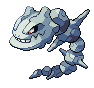

## All Other Rooms

<table><tr><th colspan="1">Encounter Method</th><th colspan="5" style = "text-align: center;">Available Pokémon</th></tr>
<tr><td rowspan="3" style="vertical-align: middle; word-wrap: break-word; text-align: center;">Cave</td><td style="text-align: center; vertical-align: bottom;">    <a href="../../pokemons/525">Boldore</a>   Lv: 66   20.0% </td><td style="text-align: center; vertical-align: bottom;">    <a href="../../pokemons/527">Woobat</a>   Lv: 62   20.0% </td><td style="text-align: center; vertical-align: bottom;">    <a href="../../pokemons/232">Donphan</a>   Lv: 68   10.0% </td><td style="text-align: center; vertical-align: bottom;">    <a href="../../pokemons/217">Ursaring</a>   Lv: 68   10.0% </td><td style="text-align: center; vertical-align: bottom;">    <a href="../../pokemons/631">Heatmor</a>   Lv: 68   10.0% </td></tr>
<tr><td style="text-align: center; vertical-align: bottom;">    <a href="../../pokemons/632">Durant</a>   Lv: 68   10.0% </td><td style="text-align: center; vertical-align: bottom;">    <a href="../../pokemons/075">Graveler</a>   Lv: 66   5.0% </td><td style="text-align: center; vertical-align: bottom;">    <a href="../../pokemons/042">Golbat</a>   Lv: 66   5.0% </td><td style="text-align: center; vertical-align: bottom;">    <a href="../../pokemons/184">Azumarill</a>   Lv: 68   4.0% </td><td style="text-align: center; vertical-align: bottom;">    <a href="../../pokemons/184">Azumarill</a>   Lv: 69   1.0% </td></tr>
<tr><td style="text-align: center; vertical-align: bottom;">    <a href="../../pokemons/095">Onix</a>   Lv: 66   4.0% </td><td style="text-align: center; vertical-align: bottom;">    <a href="../../pokemons/095">Onix</a>   Lv: 68   1.0% </td><td></td><td></td><td></td></tr>
<tr><td rowspan="1" style="vertical-align: middle; word-wrap: break-word; text-align: center;">Dust Cloud</td><td style="text-align: center; vertical-align: bottom;">    <a href="../../pokemons/530">Excadrill</a>   Lv: 68   60.0% </td><td style="text-align: center; vertical-align: bottom;">    <a href="../../pokemons/530">Excadrill</a>   Lv: 69   30.0% </td><td style="text-align: center; vertical-align: bottom;">    <a href="../../pokemons/530">Excadrill</a>   Lv: 70   10.0% </td><td></td><td></td></tr></table>
## Ice Room

<table><tr><th colspan="1">Encounter Method</th><th colspan="5" style = "text-align: center;">Available Pokémon</th></tr>
<tr><td rowspan="2" style="vertical-align: middle; word-wrap: break-word; text-align: center;">Cave</td><td style="text-align: center; vertical-align: bottom;">    <a href="../../pokemons/615">Cryogonal</a>   Lv: 68   20.0% </td><td style="text-align: center; vertical-align: bottom;">    <a href="../../pokemons/615">Cryogonal</a>   Lv: 69   20.0% </td><td style="text-align: center; vertical-align: bottom;">    <a href="../../pokemons/614">Beartic</a>   Lv: 69   10.0% </td><td style="text-align: center; vertical-align: bottom;">    <a href="../../pokemons/614">Beartic</a>   Lv: 70   5.0% </td><td style="text-align: center; vertical-align: bottom;">    <a href="../../pokemons/217">Ursaring</a>   Lv: 69   10.0% </td></tr>
<tr><td style="text-align: center; vertical-align: bottom;">    <a href="../../pokemons/362">Glalie</a>   Lv: 68   10.0% </td><td style="text-align: center; vertical-align: bottom;">    <a href="../../pokemons/362">Glalie</a>   Lv: 69   10.0% </td><td style="text-align: center; vertical-align: bottom;">    <a href="../../pokemons/525">Boldore</a>   Lv: 66   5.0% </td><td style="text-align: center; vertical-align: bottom;">    <a href="../../pokemons/583">Vanillish</a>   Lv: 66   5.0% </td><td style="text-align: center; vertical-align: bottom;">    <a href="../../pokemons/583">Vanillish</a>   Lv: 68   5.0% </td></tr>
<tr><td rowspan="1" style="vertical-align: middle; word-wrap: break-word; text-align: center;">Dust Cloud</td><td style="text-align: center; vertical-align: bottom;">    <a href="../../pokemons/208">Steelix</a>   Lv: 68   60.0% </td><td style="text-align: center; vertical-align: bottom;">    <a href="../../pokemons/208">Steelix</a>   Lv: 69   30.0% </td><td style="text-align: center; vertical-align: bottom;">    <a href="../../pokemons/208">Steelix</a>   Lv: 70   10.0% </td><td></td><td></td></tr></table>
