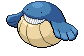

## Autumn, Spring, Summer

<table><tr><th colspan="1">Encounter Method</th><th colspan="5" style = "text-align: center;">Available Pokémon</th></tr>
<tr><td rowspan="1" style="vertical-align: middle; word-wrap: break-word; text-align: center;">Surf</td><td style="text-align: center; vertical-align: bottom;">    <a href="../../pokemons/592">Frillish</a>   Lv: 40-46   60.0% </td><td style="text-align: center; vertical-align: bottom;">    <a href="../../pokemons/458">Mantyke</a>   Lv: 40-46   30.0% </td><td style="text-align: center; vertical-align: bottom;">    <a href="../../pokemons/320">Wailmer</a>   Lv: 40-46   10.0% </td><td></td><td></td></tr>
<tr><td rowspan="1" style="vertical-align: middle; word-wrap: break-word; text-align: center;">Surf, Rippling Water</td><td style="text-align: center; vertical-align: bottom;">    <a href="../../pokemons/458">Mantyke</a>   Lv: 40-46   65.0% </td><td style="text-align: center; vertical-align: bottom;">    <a href="../../pokemons/320">Wailmer</a>   Lv: 40-46   30.0% </td><td style="text-align: center; vertical-align: bottom;">    <a href="../../pokemons/321">Wailord</a>   Lv: 40-46   5.0% </td><td></td><td></td></tr>
<tr><td rowspan="1" style="vertical-align: middle; word-wrap: break-word; text-align: center;">Fish</td><td style="text-align: center; vertical-align: bottom;">    <a href="../../pokemons/223">Remoraid</a>   Lv: 40-46   60.0% </td><td style="text-align: center; vertical-align: bottom;">    <a href="../../pokemons/170">Chinchou</a>   Lv: 40-46   30.0% </td><td style="text-align: center; vertical-align: bottom;">    <a href="../../pokemons/116">Horsea</a>   Lv: 40-46   10.0% </td><td></td><td></td></tr>
<tr><td rowspan="1" style="vertical-align: middle; word-wrap: break-word; text-align: center;">Fish, Rippling Water</td><td style="text-align: center; vertical-align: bottom;">    <a href="../../pokemons/116">Horsea</a>   Lv: 40-46   60.0% </td><td style="text-align: center; vertical-align: bottom;">    <a href="../../pokemons/224">Octillery</a>   Lv: 40-46   30.0% </td><td style="text-align: center; vertical-align: bottom;">    <a href="../../pokemons/171">Lanturn</a>   Lv: 40-46   10.0% </td><td></td><td></td></tr>
<tr><td rowspan="1" style="vertical-align: middle; word-wrap: break-word; text-align: center;">Special Event</td><td style="text-align: center; vertical-align: bottom;">    <a href="../../pokemons/593">Jellicent</a>   Lv: 45   100.0% </td><td></td><td></td><td></td><td></td></tr></table>
## Winter

<table><tr><th colspan="1">Encounter Method</th><th colspan="5" style = "text-align: center;">Available Pokémon</th></tr>
<tr><td rowspan="1" style="vertical-align: middle; word-wrap: break-word; text-align: center;">Surf</td><td style="text-align: center; vertical-align: bottom;">    <a href="../../pokemons/592">Frillish</a>   Lv: 40-46   60.0% </td><td style="text-align: center; vertical-align: bottom;">    <a href="../../pokemons/363">Spheal</a>   Lv: 40-46   30.0% </td><td style="text-align: center; vertical-align: bottom;">    <a href="../../pokemons/320">Wailmer</a>   Lv: 40-46   10.0% </td><td></td><td></td></tr>
<tr><td rowspan="1" style="vertical-align: middle; word-wrap: break-word; text-align: center;">Surf, Rippling Water</td><td style="text-align: center; vertical-align: bottom;">    <a href="../../pokemons/364">Sealeo</a>   Lv: 40-46   65.0% </td><td style="text-align: center; vertical-align: bottom;">    <a href="../../pokemons/320">Wailmer</a>   Lv: 40-46   30.0% </td><td style="text-align: center; vertical-align: bottom;">    <a href="../../pokemons/321">Wailord</a>   Lv: 40-46   5.0% </td><td></td><td></td></tr>
<tr><td rowspan="1" style="vertical-align: middle; word-wrap: break-word; text-align: center;">Fish</td><td style="text-align: center; vertical-align: bottom;">    <a href="../../pokemons/223">Remoraid</a>   Lv: 40-46   60.0% </td><td style="text-align: center; vertical-align: bottom;">    <a href="../../pokemons/170">Chinchou</a>   Lv: 40-46   30.0% </td><td style="text-align: center; vertical-align: bottom;">    <a href="../../pokemons/116">Horsea</a>   Lv: 40-46   10.0% </td><td></td><td></td></tr>
<tr><td rowspan="1" style="vertical-align: middle; word-wrap: break-word; text-align: center;">Fish, Rippling Water</td><td style="text-align: center; vertical-align: bottom;">    <a href="../../pokemons/116">Horsea</a>   Lv: 40-46   60.0% </td><td style="text-align: center; vertical-align: bottom;">    <a href="../../pokemons/224">Octillery</a>   Lv: 40-46   30.0% </td><td style="text-align: center; vertical-align: bottom;">    <a href="../../pokemons/171">Lanturn</a>   Lv: 40-46   10.0% </td><td></td><td></td></tr>
<tr><td rowspan="1" style="vertical-align: middle; word-wrap: break-word; text-align: center;">Special Event</td><td style="text-align: center; vertical-align: bottom;">    <a href="../../pokemons/593">Jellicent</a>   Lv: 45   100.0% </td><td></td><td></td><td></td><td></td></tr></table>
