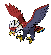
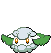

## Ruined Area

<table><tr><th colspan="1">Encounter Method</th><th colspan="5" style = "text-align: center;">Available Pokémon</th></tr>
<tr><td rowspan="2" style="vertical-align: middle; word-wrap: break-word; text-align: center;">Cave</td><td style="text-align: center; vertical-align: bottom;">    <a href="../../pokemons/359">Absol</a>   Lv: 59-62   30.0% </td><td style="text-align: center; vertical-align: bottom;">    <a href="../../pokemons/623">Golurk</a>   Lv: 59-62   20.0% </td><td style="text-align: center; vertical-align: bottom;">    <a href="../../pokemons/354">Banette</a>   Lv: 59-62   10.0% </td><td style="text-align: center; vertical-align: bottom;">    <a href="../../pokemons/356">Dusclops</a>   Lv: 59-62   10.0% </td><td style="text-align: center; vertical-align: bottom;">    <a href="../../pokemons/097">Hypno</a>   Lv: 59-62   10.0% </td></tr>
<tr><td style="text-align: center; vertical-align: bottom;">    <a href="../../pokemons/608">Lampent</a>   Lv: 59-62   10.0% </td><td style="text-align: center; vertical-align: bottom;">    <a href="../../pokemons/575">Gothorita</a>   Lv: 59-62   5.0% </td><td style="text-align: center; vertical-align: bottom;">    <a href="../../pokemons/578">Duosion</a>   Lv: 59-62   5.0% </td><td></td><td></td></tr>
<tr><td rowspan="1" style="vertical-align: middle; word-wrap: break-word; text-align: center;">Surf</td><td style="text-align: center; vertical-align: bottom;">    <a href="../../pokemons/550">Basculin-Blue</a>   Lv: 60-70   70.0% </td><td style="text-align: center; vertical-align: bottom;">    <a href="../../pokemons/183">Marill</a>   Lv: 60-70   30.0% </td><td style="text-align: center; vertical-align: bottom;">    <a href="../../pokemons/184">Azumarill</a>   Lv: 60-70   10.0% </td><td></td><td></td></tr>
<tr><td rowspan="1" style="vertical-align: middle; word-wrap: break-word; text-align: center;">Surf, Rippling Water</td><td style="text-align: center; vertical-align: bottom;">    <a href="../../pokemons/183">Marill</a>   Lv: 60-70   60.0% </td><td style="text-align: center; vertical-align: bottom;">    <a href="../../pokemons/550">Basculin-Red</a>   Lv: 60-70   30.0% </td><td></td><td></td><td></td></tr>
<tr><td rowspan="1" style="vertical-align: middle; word-wrap: break-word; text-align: center;">Fish</td><td style="text-align: center; vertical-align: bottom;">    <a href="../../pokemons/592">Frillish</a>   Lv: 60-70   70.0% </td><td style="text-align: center; vertical-align: bottom;">    <a href="../../pokemons/550">Basculin-Blue</a>   Lv: 60-70   30.0% </td><td></td><td></td><td></td></tr>
<tr><td rowspan="1" style="vertical-align: middle; word-wrap: break-word; text-align: center;">Fish, Rippling Water</td><td style="text-align: center; vertical-align: bottom;">    <a href="../../pokemons/592">Frillish</a>   Lv: 60-70   65.0% </td><td style="text-align: center; vertical-align: bottom;">    <a href="../../pokemons/550">Basculin-Red</a>   Lv: 60-70   30.0% </td><td></td><td></td><td></td></tr></table>
## Lower Mountainside

<table><tr><th colspan="1">Encounter Method</th><th colspan="5" style = "text-align: center;">Available Pokémon</th></tr>
<tr><td rowspan="2" style="vertical-align: middle; word-wrap: break-word; text-align: center;">Grass</td><td style="text-align: center; vertical-align: bottom;">    <a href="../../pokemons/520">Tranquill</a>   Lv: 59-62   20.0% </td><td style="text-align: center; vertical-align: bottom;">    <a href="../../pokemons/334">Altaria</a>   Lv: 59-62   20.0% </td><td style="text-align: center; vertical-align: bottom;">    <a href="../../pokemons/053">Persian</a>   Lv: 59-62   10.0% </td><td style="text-align: center; vertical-align: bottom;">    <a href="../../pokemons/560">Scrafty</a>   Lv: 59-62   10.0% </td><td style="text-align: center; vertical-align: bottom;">    <a href="../../pokemons/095">Onix</a>   Lv: 59-62   10.0% </td></tr>
<tr><td style="text-align: center; vertical-align: bottom;">    <a href="../../pokemons/227">Skarmory</a>   Lv: 59-62   10.0% </td><td style="text-align: center; vertical-align: bottom;">    <a href="../../pokemons/022">Fearow</a>   Lv: 59-62   10.0% </td><td style="text-align: center; vertical-align: bottom;">    <a href="../../pokemons/630">Mandibuzz</a>   Lv: 59-62   5.0% </td><td style="text-align: center; vertical-align: bottom;">    <a href="../../pokemons/628">Braviary</a>   Lv: 59-62   5.0% </td><td></td></tr>
<tr><td rowspan="2" style="vertical-align: middle; word-wrap: break-word; text-align: center;">Dark Grass (Doubles)</td><td style="text-align: center; vertical-align: bottom;">    <a href="../../pokemons/520">Tranquill</a>   Lv: 60-65   20.0% </td><td style="text-align: center; vertical-align: bottom;">    <a href="../../pokemons/334">Altaria</a>   Lv: 60-65   20.0% </td><td style="text-align: center; vertical-align: bottom;">    <a href="../../pokemons/053">Persian</a>   Lv: 60-65   10.0% </td><td style="text-align: center; vertical-align: bottom;">    <a href="../../pokemons/560">Scrafty</a>   Lv: 60-65   10.0% </td><td style="text-align: center; vertical-align: bottom;">    <a href="../../pokemons/095">Onix</a>   Lv: 60-65   10.0% </td></tr>
<tr><td style="text-align: center; vertical-align: bottom;">    <a href="../../pokemons/227">Skarmory</a>   Lv: 60-65   10.0% </td><td style="text-align: center; vertical-align: bottom;">    <a href="../../pokemons/630">Mandibuzz</a>   Lv: 60-65   5.0% </td><td style="text-align: center; vertical-align: bottom;">    <a href="../../pokemons/628">Braviary</a>   Lv: 60-65   5.0% </td><td style="text-align: center; vertical-align: bottom;">    <a href="../../pokemons/022">Fearow</a>   Lv: 60-65   5.0% </td><td></td></tr>
<tr><td rowspan="1" style="vertical-align: middle; word-wrap: break-word; text-align: center;">Shaking Grass</td><td style="text-align: center; vertical-align: bottom;">    <a href="../../pokemons/531">Audino</a>   Lv: 56   80.0% </td><td style="text-align: center; vertical-align: bottom;">    <a href="../../pokemons/206">Dunsparce</a>   Lv: 56   10.0% </td><td style="text-align: center; vertical-align: bottom;">    <a href="../../pokemons/521">Unfezant</a>   Lv: 57   10.0% </td><td></td><td></td></tr>
<tr><td rowspan="1" style="vertical-align: middle; word-wrap: break-word; text-align: center;">Surf</td><td style="text-align: center; vertical-align: bottom;">    <a href="../../pokemons/418">Buizel</a>   Lv: 60-70   60.0% </td><td style="text-align: center; vertical-align: bottom;">    <a href="../../pokemons/550">Basculin-Blue</a>   Lv: 60-70   30.0% </td><td style="text-align: center; vertical-align: bottom;">    <a href="../../pokemons/419">Floatzel</a>   Lv: 60-70   10.0% </td><td></td><td></td></tr>
<tr><td rowspan="1" style="vertical-align: middle; word-wrap: break-word; text-align: center;">Surf, Rippling Water</td><td style="text-align: center; vertical-align: bottom;">    <a href="../../pokemons/418">Buizel</a>   Lv: 60-70   60.0% </td><td style="text-align: center; vertical-align: bottom;">    <a href="../../pokemons/550">Basculin-Red</a>   Lv: 60-70   30.0% </td><td style="text-align: center; vertical-align: bottom;">    <a href="../../pokemons/419">Floatzel</a>   Lv: 60-70   10.0% </td><td></td><td></td></tr>
<tr><td rowspan="1" style="vertical-align: middle; word-wrap: break-word; text-align: center;">Fish</td><td style="text-align: center; vertical-align: bottom;">    <a href="../../pokemons/592">Frillish</a>   Lv: 60-70   70.0% </td><td style="text-align: center; vertical-align: bottom;">    <a href="../../pokemons/550">Basculin-Blue</a>   Lv: 60-70   30.0% </td><td></td><td></td><td></td></tr>
<tr><td rowspan="1" style="vertical-align: middle; word-wrap: break-word; text-align: center;">Fish, Rippling Water</td><td style="text-align: center; vertical-align: bottom;">    <a href="../../pokemons/592">Frillish</a>   Lv: 60-70   70.0% </td><td style="text-align: center; vertical-align: bottom;">    <a href="../../pokemons/550">Basculin-Red</a>   Lv: 60-70   30.0% </td><td></td><td></td><td></td></tr></table>
## Forest

<table><tr><th colspan="1">Encounter Method</th><th colspan="5" style = "text-align: center;">Available Pokémon</th></tr>
<tr><td rowspan="2" style="vertical-align: middle; word-wrap: break-word; text-align: center;">Grass</td><td style="text-align: center; vertical-align: bottom;">    <a href="../../pokemons/546">Cottonee</a>   Lv: 59-62   20.0% </td><td style="text-align: center; vertical-align: bottom;">    <a href="../../pokemons/548">Petilil</a>   Lv: 59-62   20.0% </td><td style="text-align: center; vertical-align: bottom;">    <a href="../../pokemons/274">Nuzleaf</a>   Lv: 59-62   10.0% </td><td style="text-align: center; vertical-align: bottom;">    <a href="../../pokemons/271">Lombre</a>   Lv: 59-62   10.0% </td><td style="text-align: center; vertical-align: bottom;">    <a href="../../pokemons/455">Carnivine</a>   Lv: 59-62   10.0% </td></tr>
<tr><td style="text-align: center; vertical-align: bottom;">    <a href="../../pokemons/315">Roselia</a>   Lv: 59-62   10.0% </td><td style="text-align: center; vertical-align: bottom;">    <a href="../../pokemons/102">Exeggcute</a>   Lv: 59-62   5.0% </td><td style="text-align: center; vertical-align: bottom;">    <a href="../../pokemons/288">Vigoroth</a>   Lv: 59-62   5.0% </td><td style="text-align: center; vertical-align: bottom;">    <a href="../../pokemons/049">Venomoth</a>   Lv: 59-62   5.0% </td><td style="text-align: center; vertical-align: bottom;">    <a href="../../pokemons/205">Forretress</a>   Lv: 59-62   5.0% </td></tr>
<tr><td rowspan="2" style="vertical-align: middle; word-wrap: break-word; text-align: center;">Dark Grass (Doubles)</td><td style="text-align: center; vertical-align: bottom;">    <a href="../../pokemons/546">Cottonee</a>   Lv: 60-65   20.0% </td><td style="text-align: center; vertical-align: bottom;">    <a href="../../pokemons/548">Petilil</a>   Lv: 60-65   20.0% </td><td style="text-align: center; vertical-align: bottom;">    <a href="../../pokemons/274">Nuzleaf</a>   Lv: 60-65   10.0% </td><td style="text-align: center; vertical-align: bottom;">    <a href="../../pokemons/271">Lombre</a>   Lv: 60-65   10.0% </td><td style="text-align: center; vertical-align: bottom;">    <a href="../../pokemons/455">Carnivine</a>   Lv: 60-65   10.0% </td></tr>
<tr><td style="text-align: center; vertical-align: bottom;">    <a href="../../pokemons/315">Roselia</a>   Lv: 60-65   10.0% </td><td style="text-align: center; vertical-align: bottom;">    <a href="../../pokemons/102">Exeggcute</a>   Lv: 60-65   5.0% </td><td style="text-align: center; vertical-align: bottom;">    <a href="../../pokemons/288">Vigoroth</a>   Lv: 60-65   5.0% </td><td style="text-align: center; vertical-align: bottom;">    <a href="../../pokemons/049">Venomoth</a>   Lv: 60-65   5.0% </td><td style="text-align: center; vertical-align: bottom;">    <a href="../../pokemons/205">Forretress</a>   Lv: 60-65   5.0% </td></tr>
<tr><td rowspan="2" style="vertical-align: middle; word-wrap: break-word; text-align: center;">Shaking Grass</td><td style="text-align: center; vertical-align: bottom;">    <a href="../../pokemons/531">Audino</a>   Lv: 56   40.0% </td><td style="text-align: center; vertical-align: bottom;">    <a href="../../pokemons/206">Dunsparce</a>   Lv: 56   10.0% </td><td style="text-align: center; vertical-align: bottom;">    <a href="../../pokemons/515">Panpour</a>   Lv: 56   10.0% </td><td style="text-align: center; vertical-align: bottom;">    <a href="../../pokemons/513">Pansear</a>   Lv: 56   10.0% </td><td style="text-align: center; vertical-align: bottom;">    <a href="../../pokemons/511">Pansage</a>   Lv: 56   10.0% </td></tr>
<tr><td style="text-align: center; vertical-align: bottom;">    <a href="../../pokemons/407">Roserade</a>   Lv: 59   5.0% </td><td style="text-align: center; vertical-align: bottom;">    <a href="../../pokemons/289">Slaking</a>   Lv: 59   5.0% </td><td style="text-align: center; vertical-align: bottom;">    <a href="../../pokemons/272">Ludicolo</a>   Lv: 59   5.0% </td><td style="text-align: center; vertical-align: bottom;">    <a href="../../pokemons/275">Shiftry</a>   Lv: 59   5.0% </td><td></td></tr></table>
## Connecting Caves I

<table><tr><th colspan="1">Encounter Method</th><th colspan="5" style = "text-align: center;">Available Pokémon</th></tr>
<tr><td rowspan="2" style="vertical-align: middle; word-wrap: break-word; text-align: center;">Cave</td><td style="text-align: center; vertical-align: bottom;">    <a href="../../pokemons/525">Boldore</a>   Lv: 59-62   20.0% </td><td style="text-align: center; vertical-align: bottom;">    <a href="../../pokemons/305">Lairon</a>   Lv: 59-62   20.0% </td><td style="text-align: center; vertical-align: bottom;">    <a href="../../pokemons/082">Magneton</a>   Lv: 59-62   10.0% </td><td style="text-align: center; vertical-align: bottom;">    <a href="../../pokemons/064">Kadabra</a>   Lv: 59-62   10.0% </td><td style="text-align: center; vertical-align: bottom;">    <a href="../../pokemons/112">Rhydon</a>   Lv: 59-62   10.0% </td></tr>
<tr><td style="text-align: center; vertical-align: bottom;">    <a href="../../pokemons/632">Durant</a>   Lv: 59-62   10.0% </td><td style="text-align: center; vertical-align: bottom;">    <a href="../../pokemons/232">Donphan</a>   Lv: 59-62   10.0% </td><td style="text-align: center; vertical-align: bottom;">    <a href="../../pokemons/217">Ursaring</a>   Lv: 59-62   10.0% </td><td></td><td></td></tr>
<tr><td rowspan="1" style="vertical-align: middle; word-wrap: break-word; text-align: center;">Dust Cloud</td><td style="text-align: center; vertical-align: bottom;">    <a href="../../pokemons/232">Donphan</a>   Lv: 60-65   60.0% </td><td style="text-align: center; vertical-align: bottom;">    <a href="../../pokemons/632">Durant</a>   Lv: 60-65   20.0% </td><td style="text-align: center; vertical-align: bottom;">    <a href="../../pokemons/631">Heatmor</a>   Lv: 60-65   20.0% </td><td></td><td></td></tr></table>
## Connecting Caves I, Back

<table><tr><th colspan="1">Encounter Method</th><th colspan="5" style = "text-align: center;">Available Pokémon</th></tr>
<tr><td rowspan="2" style="vertical-align: middle; word-wrap: break-word; text-align: center;">Cave</td><td style="text-align: center; vertical-align: bottom;">    <a href="../../pokemons/525">Boldore</a>   Lv: 59-62   20.0% </td><td style="text-align: center; vertical-align: bottom;">    <a href="../../pokemons/075">Graveler</a>   Lv: 59-62   20.0% </td><td style="text-align: center; vertical-align: bottom;">    <a href="../../pokemons/047">Parasect</a>   Lv: 59-62   10.0% </td><td style="text-align: center; vertical-align: bottom;">    <a href="../../pokemons/202">Wobbuffet</a>   Lv: 59-62   10.0% </td><td style="text-align: center; vertical-align: bottom;">    <a href="../../pokemons/303">Mawile</a>   Lv: 59-62   10.0% </td></tr>
<tr><td style="text-align: center; vertical-align: bottom;">    <a href="../../pokemons/302">Sableye</a>   Lv: 59-62   10.0% </td><td style="text-align: center; vertical-align: bottom;">    <a href="../../pokemons/042">Golbat</a>   Lv: 59-62   5.0% </td><td style="text-align: center; vertical-align: bottom;">    <a href="../../pokemons/101">Electrode</a>   Lv: 59-62   5.0% </td><td style="text-align: center; vertical-align: bottom;">    <a href="../../pokemons/132">Ditto</a>   Lv: 59-62   5.0% </td><td style="text-align: center; vertical-align: bottom;">    <a href="../../pokemons/530">Excadrill</a>   Lv: 59-62   5.0% </td></tr>
<tr><td rowspan="1" style="vertical-align: middle; word-wrap: break-word; text-align: center;">Dust Cloud</td><td style="text-align: center; vertical-align: bottom;">    <a href="../../pokemons/047">Parasect</a>   Lv: 60-65   60.0% </td><td style="text-align: center; vertical-align: bottom;">    <a href="../../pokemons/217">Ursaring</a>   Lv: 60-65   40.0% </td><td></td><td></td><td></td></tr></table>
## Upper Mountainside

<table><tr><th colspan="1">Encounter Method</th><th colspan="5" style = "text-align: center;">Available Pokémon</th></tr>
<tr><td rowspan="2" style="vertical-align: middle; word-wrap: break-word; text-align: center;">Grass</td><td style="text-align: center; vertical-align: bottom;">    <a href="../../pokemons/533">Gurdurr</a>   Lv: 59-62   20.0% </td><td style="text-align: center; vertical-align: bottom;">    <a href="../../pokemons/067">Machoke</a>   Lv: 59-62   20.0% </td><td style="text-align: center; vertical-align: bottom;">    <a href="../../pokemons/538">Throh</a>   Lv: 59-62   10.0% </td><td style="text-align: center; vertical-align: bottom;">    <a href="../../pokemons/539">Sawk</a>   Lv: 59-62   10.0% </td><td style="text-align: center; vertical-align: bottom;">    <a href="../../pokemons/033">Nidorino</a>   Lv: 59-62   10.0% </td></tr>
<tr><td style="text-align: center; vertical-align: bottom;">    <a href="../../pokemons/030">Nidorina</a>   Lv: 59-62   10.0% </td><td style="text-align: center; vertical-align: bottom;">    <a href="../../pokemons/308">Medicham</a>   Lv: 59-62   5.0% </td><td style="text-align: center; vertical-align: bottom;">    <a href="../../pokemons/057">Primeape</a>   Lv: 59-62   5.0% </td><td style="text-align: center; vertical-align: bottom;">    <a href="../../pokemons/631">Heatmor</a>   Lv: 59-62   5.0% </td><td style="text-align: center; vertical-align: bottom;">    <a href="../../pokemons/447">Riolu</a>   Lv: 59-62   5.0% </td></tr>
<tr><td rowspan="2" style="vertical-align: middle; word-wrap: break-word; text-align: center;">Dark Grass (Doubles)</td><td style="text-align: center; vertical-align: bottom;">    <a href="../../pokemons/533">Gurdurr</a>   Lv: 60-65   20.0% </td><td style="text-align: center; vertical-align: bottom;">    <a href="../../pokemons/067">Machoke</a>   Lv: 60-65   20.0% </td><td style="text-align: center; vertical-align: bottom;">    <a href="../../pokemons/538">Throh</a>   Lv: 60-65   10.0% </td><td style="text-align: center; vertical-align: bottom;">    <a href="../../pokemons/539">Sawk</a>   Lv: 60-65   10.0% </td><td style="text-align: center; vertical-align: bottom;">    <a href="../../pokemons/033">Nidorino</a>   Lv: 60-65   10.0% </td></tr>
<tr><td style="text-align: center; vertical-align: bottom;">    <a href="../../pokemons/030">Nidorina</a>   Lv: 60-65   10.0% </td><td style="text-align: center; vertical-align: bottom;">    <a href="../../pokemons/308">Medicham</a>   Lv: 60-65   5.0% </td><td style="text-align: center; vertical-align: bottom;">    <a href="../../pokemons/057">Primeape</a>   Lv: 60-65   5.0% </td><td style="text-align: center; vertical-align: bottom;">    <a href="../../pokemons/631">Heatmor</a>   Lv: 60-65   5.0% </td><td style="text-align: center; vertical-align: bottom;">    <a href="../../pokemons/447">Riolu</a>   Lv: 60-65   5.0% </td></tr>
<tr><td rowspan="1" style="vertical-align: middle; word-wrap: break-word; text-align: center;">Shaking Grass</td><td style="text-align: center; vertical-align: bottom;">    <a href="../../pokemons/531">Audino</a>   Lv: 65   85.0% </td><td style="text-align: center; vertical-align: bottom;">    <a href="../../pokemons/031">Nidoqueen</a>   Lv: 60-65   5.0% </td><td style="text-align: center; vertical-align: bottom;">    <a href="../../pokemons/034">Nidoking</a>   Lv: 60-65   5.0% </td><td style="text-align: center; vertical-align: bottom;">    <a href="../../pokemons/448">Lucario</a>   Lv: 60-65   5.0% </td><td></td></tr></table>
## Connecting Caves II, Dragons

<table><tr><th colspan="1">Encounter Method</th><th colspan="5" style = "text-align: center;">Available Pokémon</th></tr>
<tr><td rowspan="2" style="vertical-align: middle; word-wrap: break-word; text-align: center;">Cave</td><td style="text-align: center; vertical-align: bottom;">    <a href="../../pokemons/621">Druddigon</a>   Lv: 59-62   40.0% </td><td style="text-align: center; vertical-align: bottom;">    <a href="../../pokemons/126">Magmar</a>   Lv: 59-62   10.0% </td><td style="text-align: center; vertical-align: bottom;">    <a href="../../pokemons/125">Electabuzz</a>   Lv: 59-62   10.0% </td><td style="text-align: center; vertical-align: bottom;">    <a href="../../pokemons/115">Kangaskhan</a>   Lv: 59-62   10.0% </td><td style="text-align: center; vertical-align: bottom;">    <a href="../../pokemons/024">Arbok</a>   Lv: 59-62   10.0% </td></tr>
<tr><td style="text-align: center; vertical-align: bottom;">    <a href="../../pokemons/372">Shelgon</a>   Lv: 59-62   5.0% </td><td style="text-align: center; vertical-align: bottom;">    <a href="../../pokemons/634">Zweilous</a>   Lv: 59-62   5.0% </td><td style="text-align: center; vertical-align: bottom;">    <a href="../../pokemons/611">Fraxure</a>   Lv: 59-62   5.0% </td><td style="text-align: center; vertical-align: bottom;">    <a href="../../pokemons/444">Gabite</a>   Lv: 59-62   5.0% </td><td></td></tr>
<tr><td rowspan="1" style="vertical-align: middle; word-wrap: break-word; text-align: center;">Dust Cloud</td><td style="text-align: center; vertical-align: bottom;">    <a href="../../pokemons/621">Druddigon</a>   Lv: 60-65   40.0% </td><td style="text-align: center; vertical-align: bottom;">    <a href="../../pokemons/208">Steelix</a>   Lv: 60-65   20.0% </td><td style="text-align: center; vertical-align: bottom;">    <a href="../../pokemons/115">Kangaskhan</a>   Lv: 60-65   20.0% </td><td style="text-align: center; vertical-align: bottom;">    <a href="../../pokemons/126">Magmar</a>   Lv: 60-65   10.0% </td><td style="text-align: center; vertical-align: bottom;">    <a href="../../pokemons/125">Electabuzz</a>   Lv: 60-65   10.0% </td></tr></table>
## Connecting Caves II, Top

<table><tr><th colspan="1">Encounter Method</th><th colspan="5" style = "text-align: center;">Available Pokémon</th></tr>
<tr><td rowspan="2" style="vertical-align: middle; word-wrap: break-word; text-align: center;">Cave</td><td style="text-align: center; vertical-align: bottom;">    <a href="../../pokemons/527">Woobat</a>   Lv: 59-62   20.0% </td><td style="text-align: center; vertical-align: bottom;">    <a href="../../pokemons/042">Golbat</a>   Lv: 59-62   20.0% </td><td style="text-align: center; vertical-align: bottom;">    <a href="../../pokemons/525">Boldore</a>   Lv: 59-62   10.0% </td><td style="text-align: center; vertical-align: bottom;">    <a href="../../pokemons/533">Gurdurr</a>   Lv: 59-62   10.0% </td><td style="text-align: center; vertical-align: bottom;">    <a href="../../pokemons/247">Pupitar</a>   Lv: 59-62   10.0% </td></tr>
<tr><td style="text-align: center; vertical-align: bottom;">    <a href="../../pokemons/297">Hariyama</a>   Lv: 59-62   10.0% </td><td style="text-align: center; vertical-align: bottom;">    <a href="../../pokemons/294">Loudred</a>   Lv: 59-62   5.0% </td><td style="text-align: center; vertical-align: bottom;">    <a href="../../pokemons/112">Rhydon</a>   Lv: 59-62   5.0% </td><td style="text-align: center; vertical-align: bottom;">    <a href="../../pokemons/632">Durant</a>   Lv: 59-62   5.0% </td><td style="text-align: center; vertical-align: bottom;">    <a href="../../pokemons/625">Bisharp</a>   Lv: 59-62   5.0% </td></tr>
<tr><td rowspan="1" style="vertical-align: middle; word-wrap: break-word; text-align: center;">Dust Cloud</td><td style="text-align: center; vertical-align: bottom;">    <a href="../../pokemons/528">Swoobat</a>   Lv: 60-65   60.0% </td><td style="text-align: center; vertical-align: bottom;">    <a href="../../pokemons/297">Hariyama</a>   Lv: 60-65   40.0% </td><td></td><td></td><td></td></tr></table>
