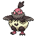

<table><tr><th colspan="1">Encounter Method</th><th colspan="5" style = "text-align: center;">Available Pokémon</th></tr>
<tr><td rowspan="2" style="vertical-align: middle; word-wrap: break-word; text-align: center;">Grass</td><td style="text-align: center; vertical-align: bottom;">    <a href="../../pokemons/102">Exeggcute</a>   Lv: 45-47   30.0% </td><td style="text-align: center; vertical-align: bottom;">    <a href="../../pokemons/580">Ducklett</a>   Lv: 46-48   20.0% </td><td style="text-align: center; vertical-align: bottom;">    <a href="../../pokemons/400">Bibarel</a>   Lv: 46-48   10.0% </td><td style="text-align: center; vertical-align: bottom;">    <a href="../../pokemons/627">Rufflet</a>   Lv: 46-48   10.0% </td><td style="text-align: center; vertical-align: bottom;">    <a href="../../pokemons/629">Vullaby</a>   Lv: 46-48   10.0% </td></tr>
<tr><td style="text-align: center; vertical-align: bottom;">    <a href="../../pokemons/313">Volbeat</a>   Lv: 46-48   5.0% </td><td style="text-align: center; vertical-align: bottom;">    <a href="../../pokemons/314">Illumise</a>   Lv: 46-48   5.0% </td><td style="text-align: center; vertical-align: bottom;">    <a href="../../pokemons/083">Farfetch'd</a>   Lv: 46-48   5.0% </td><td style="text-align: center; vertical-align: bottom;">    <a href="../../pokemons/441">Chatot</a>   Lv: 46-48   5.0% </td><td></td></tr>
<tr><td rowspan="2" style="vertical-align: middle; word-wrap: break-word; text-align: center;">Dark Grass (Doubles) </td><td style="text-align: center; vertical-align: bottom;">    <a href="../../pokemons/102">Exeggcute</a>   Lv: 45-47   30.0% </td><td style="text-align: center; vertical-align: bottom;">    <a href="../../pokemons/580">Ducklett</a>   Lv: 46-48   20.0% </td><td style="text-align: center; vertical-align: bottom;">    <a href="../../pokemons/400">Bibarel</a>   Lv: 46-48   10.0% </td><td style="text-align: center; vertical-align: bottom;">    <a href="../../pokemons/627">Rufflet</a>   Lv: 46-48   10.0% </td><td style="text-align: center; vertical-align: bottom;">    <a href="../../pokemons/629">Vullaby</a>   Lv: 46-48   10.0% </td></tr>
<tr><td style="text-align: center; vertical-align: bottom;">    <a href="../../pokemons/313">Volbeat</a>   Lv: 46-48   5.0% </td><td style="text-align: center; vertical-align: bottom;">    <a href="../../pokemons/314">Illumise</a>   Lv: 46-48   5.0% </td><td style="text-align: center; vertical-align: bottom;">    <a href="../../pokemons/083">Farfetch'd</a>   Lv: 46-48   5.0% </td><td style="text-align: center; vertical-align: bottom;">    <a href="../../pokemons/441">Chatot</a>   Lv: 46-48   5.0% </td><td></td></tr>
<tr><td rowspan="1" style="vertical-align: middle; word-wrap: break-word; text-align: center;">Shaking Grass</td><td style="text-align: center; vertical-align: bottom;">    <a href="../../pokemons/531">Audino</a>   Lv: 47-49   70.0% </td><td style="text-align: center; vertical-align: bottom;">    <a href="../../pokemons/587">Emolga</a>   Lv: 47-49   10.0% </td><td style="text-align: center; vertical-align: bottom;">    <a href="../../pokemons/206">Dunsparce</a>   Lv: 47-49   10.0% </td><td style="text-align: center; vertical-align: bottom;">    <a href="../../pokemons/103">Exeggutor</a>   Lv: 47-49   5.0% </td><td style="text-align: center; vertical-align: bottom;">    <a href="../../pokemons/184">Azumarill</a>   Lv: 47-49   5.0% </td></tr>
<tr><td rowspan="1" style="vertical-align: middle; word-wrap: break-word; text-align: center;">Surf</td><td style="text-align: center; vertical-align: bottom;">    <a href="../../pokemons/183">Marill</a>   Lv: 42-48   70.0% </td><td style="text-align: center; vertical-align: bottom;">    <a href="../../pokemons/550">Basculin-Blue</a>   Lv: 42-48   30.0% </td><td style="text-align: center; vertical-align: bottom;">    <a href="../../pokemons/131">Lapras</a>   Lv: 42-48   5.0% </td><td></td><td></td></tr>
<tr><td rowspan="1" style="vertical-align: middle; word-wrap: break-word; text-align: center;">Surf, Rippling Water</td><td style="text-align: center; vertical-align: bottom;">    <a href="../../pokemons/581">Swanna</a>   Lv: 42-48   60.0% </td><td style="text-align: center; vertical-align: bottom;">    <a href="../../pokemons/131">Lapras</a>   Lv: 42-48   30.0% </td><td style="text-align: center; vertical-align: bottom;">    <a href="../../pokemons/184">Azumarill</a>   Lv: 42-48   5.0% </td><td></td><td></td></tr>
<tr><td rowspan="1" style="vertical-align: middle; word-wrap: break-word; text-align: center;">Fish</td><td style="text-align: center; vertical-align: bottom;">    <a href="../../pokemons/318">Carvanha</a>   Lv: 42-48   70.0% </td><td style="text-align: center; vertical-align: bottom;">    <a href="../../pokemons/550">Basculin-Blue</a>   Lv: 42-48   30.0% </td><td></td><td></td><td></td></tr>
<tr><td rowspan="1" style="vertical-align: middle; word-wrap: break-word; text-align: center;">Fish, Rippling Water</td><td style="text-align: center; vertical-align: bottom;">    <a href="../../pokemons/550">Basculin-Red</a>   Lv: 42-48   60.0% </td><td style="text-align: center; vertical-align: bottom;">    <a href="../../pokemons/318">Carvanha</a>   Lv: 42-48   30.0% </td><td style="text-align: center; vertical-align: bottom;">    <a href="../../pokemons/319">Sharpedo</a>   Lv: 42-48   10.0% </td><td></td><td></td></tr></table>