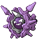

<table><tr><th colspan="1">Encounter Method</th><th colspan="5" style = "text-align: center;">Available Pokémon</th></tr>
<tr><td rowspan="3" style="vertical-align: middle; word-wrap: break-word; text-align: center;">Cave</td><td style="text-align: center; vertical-align: bottom;">    <a href="../../pokemons/525">Boldore</a>   Lv: 66   20.0% </td><td style="text-align: center; vertical-align: bottom;">    <a href="../../pokemons/525">Boldore</a>   Lv: 67   10.0% </td><td style="text-align: center; vertical-align: bottom;">    <a href="../../pokemons/525">Boldore</a>   Lv: 68   10.0% </td><td style="text-align: center; vertical-align: bottom;">    <a href="../../pokemons/528">Swoobat</a>   Lv: 68   20.0% </td><td style="text-align: center; vertical-align: bottom;">    <a href="../../pokemons/528">Swoobat</a>   Lv: 69   10.0% </td></tr>
<tr><td style="text-align: center; vertical-align: bottom;">    <a href="../../pokemons/528">Swoobat</a>   Lv: 70   10.0% </td><td style="text-align: center; vertical-align: bottom;">    <a href="../../pokemons/042">Golbat</a>   Lv: 66   5.0% </td><td style="text-align: center; vertical-align: bottom;">    <a href="../../pokemons/042">Golbat</a>   Lv: 67   4.0% </td><td style="text-align: center; vertical-align: bottom;">    <a href="../../pokemons/042">Golbat</a>   Lv: 68   1.0% </td><td style="text-align: center; vertical-align: bottom;">    <a href="../../pokemons/294">Loudred</a>   Lv: 66   5.0% </td></tr>
<tr><td style="text-align: center; vertical-align: bottom;">    <a href="../../pokemons/294">Loudred</a>   Lv: 67   4.0% </td><td style="text-align: center; vertical-align: bottom;">    <a href="../../pokemons/294">Loudred</a>   Lv: 68   1.0% </td><td></td><td></td><td></td></tr>
<tr><td rowspan="1" style="vertical-align: middle; word-wrap: break-word; text-align: center;">Dust Cloud</td><td style="text-align: center; vertical-align: bottom;">    <a href="../../pokemons/051">Dugtrio</a>   Lv: 70   40.0% </td><td style="text-align: center; vertical-align: bottom;">    <a href="../../pokemons/530">Excadrill</a>   Lv: 70   40.0% </td><td style="text-align: center; vertical-align: bottom;">    <a href="../../pokemons/095">Onix</a>   Lv: 68   20.0% </td><td></td><td></td></tr>
<tr><td rowspan="1" style="vertical-align: middle; word-wrap: break-word; text-align: center;">Surf</td><td style="text-align: center; vertical-align: bottom;">    <a href="../../pokemons/194">Wooper</a>   Lv: 45-55   60.0% </td><td style="text-align: center; vertical-align: bottom;">    <a href="../../pokemons/550">Basculin-Blue</a>   Lv: 55-65   30.0% </td><td style="text-align: center; vertical-align: bottom;">    <a href="../../pokemons/195">Quagsire</a>   Lv: 55-65   10.0% </td><td></td><td></td></tr>
<tr><td rowspan="1" style="vertical-align: middle; word-wrap: break-word; text-align: center;">Surf, Rippling Water</td><td style="text-align: center; vertical-align: bottom;">    <a href="../../pokemons/194">Wooper</a>   Lv: 55-65   60.0% </td><td style="text-align: center; vertical-align: bottom;">    <a href="../../pokemons/550">Basculin-Red</a>   Lv: 60-70   35.0% </td><td style="text-align: center; vertical-align: bottom;">    <a href="../../pokemons/195">Quagsire</a>   Lv: 60-70   5.0% </td><td></td><td></td></tr>
<tr><td rowspan="1" style="vertical-align: middle; word-wrap: break-word; text-align: center;">Fish</td><td style="text-align: center; vertical-align: bottom;">    <a href="../../pokemons/339">Barboach</a>   Lv: 50-60   60.0% </td><td style="text-align: center; vertical-align: bottom;">    <a href="../../pokemons/090">Shellder</a>   Lv: 50-60   30.0% </td><td style="text-align: center; vertical-align: bottom;">    <a href="../../pokemons/340">Whiscash</a>   Lv: 55-65   10.0% </td><td></td><td></td></tr>
<tr><td rowspan="1" style="vertical-align: middle; word-wrap: break-word; text-align: center;">Fish, Rippling Water</td><td style="text-align: center; vertical-align: bottom;">    <a href="../../pokemons/090">Shellder</a>   Lv: 65   60.0% </td><td style="text-align: center; vertical-align: bottom;">    <a href="../../pokemons/340">Whiscash</a>   Lv: 65-75   35.0% </td><td style="text-align: center; vertical-align: bottom;">    <a href="../../pokemons/091">Cloyster</a>   Lv: 65-75   5.0% </td><td></td><td></td></tr></table>